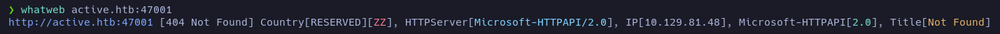

# Active

**Date**: 27/06/2022

**Difficulty**: Easy

**CTF**: [https://app.hackthebox.com/machines/148](https://app.hackthebox.com/machines/148)

---

Let’s start with the classic ping to test the connection with the target machine:

<figure><figcaption></figcaption></figure>

1 packet emitted, 1 packet received. The ttl shows a value of 127 which in HTB means that we are probably against a Windows machine.

Let’s do a scan of the TCP ports to find which ones are open:

<figure><figcaption></figcaption></figure>

Wow, it shows a bunch of open TCP ports. Let’s do a further scan in these ports:

<figure><figcaption></figcaption></figure>

We have much information here. First of all we have kerberos, RPC and ldap services. We also have a DNS service in port 53 and a http service running on port 47001.

Let’s see if we can any info from the DNS service:

<figure><figcaption></figcaption></figure>

Apparently nothing… Let’s see the http service:

<figure><figcaption></figcaption></figure>

Ok, we also have the port 445 open which is usually used by SMB… Let’s try to obtain more info using crackmapexec:

<figure><figcaption></figcaption></figure>

<figure><figcaption></figcaption></figure>

If we search the Build version, we can find that the target server is a Windows Server 2008 R2, SP1.

Now we know that the domain is `active.htb` let’s add it to the `/etc/hosts`.

<figure><figcaption></figcaption></figure>

<figure><figcaption></figcaption></figure>

But the http service looks the same.

Let’s try to enumerate the smb:

<figure><figcaption></figcaption></figure>

We have READ permissions to the folder Replication. Let’s look inside!

<figure><figcaption></figcaption></figure>

<figure><figcaption></figcaption></figure>

<figure><figcaption></figcaption></figure>

Every folder at this level was empty.

<figure><figcaption></figcaption></figure>

<figure><figcaption></figcaption></figure>

It seems like it may have interesting files… let’s download all the folder to navigate more quickly:

`smbget -R smb://10.129.81.48/Replication`

<figure><figcaption></figcaption></figure>

<figure><figcaption></figcaption></figure>

<figure><figcaption></figcaption></figure>

<figure><figcaption></figcaption></figure>

<figure><figcaption></figcaption></figure>

<figure><figcaption></figcaption></figure>

<figure><figcaption></figcaption></figure>

Maybe we have credentials here?

`active.htb\SVC_TGS : edBSHOwhZLTjt/QS9FeIcJ83mjWA98gw9guKOhJOdcqh+ZGMeXOsQbCpZ3xUjTLfCuNH8pG5aSVYdYw/NglVmQ`

<figure><figcaption></figcaption></figure>

Is not that simple… Let’s see if the username at least is valid using kerbrute:

<figure><figcaption></figcaption></figure>

Yes, it is. So we have a valid username but not its password I guess.

Doing some research, I found [this](https://vk9-sec.com/exploiting-gpp-sysvol-groups-xml/):

<figure><figcaption></figcaption></figure>

So the password seems to be encrypted in AES-256 and we can crack it using gpp-decrypt.

<figure><figcaption></figcaption></figure>

Let’s save this credential in a file.

<figure><figcaption></figcaption></figure>

And now let’s test it:

<figure><figcaption></figcaption></figure>

Yes, it’s valid!

<figure><figcaption></figcaption></figure>

Now, using this credentials we have access to more folders. Let’s look into `Users`:

<figure><figcaption></figcaption></figure>

Can we list the Administrator folder?

<figure><figcaption></figcaption></figure>

Nope. Let’s try with the rest:

<figure><figcaption></figcaption></figure>

Apparently the userflag is in `Users/SVC_TGS/Desktop` path. Let’s download it!

<figure><figcaption></figcaption></figure>

After enumerate the SMB I have found nothing else interesting, let’s try to do a `ldapdomaindumpH`

<figure><figcaption></figcaption></figure>

<figure><figcaption></figcaption></figure>

As we saw earlier it is a Windows Server 2008 R2 SP1.

<figure><figcaption></figcaption></figure>

Apparently there are only 4 users

- SVC_TGS: we have its credentials
- krbtgt: Key Distribution Center Service Account
- Guest
- Administrator

Let’s try a Kerberoast attack:

`❯ sudo python3 /home/angellm/THM/CTF/Relevant/impacket/build/scripts-3.9/GetUserSPNs.py active.htb/SVC_TGS:GP#################18 -dc-ip 10.129.104.47 -request`

<figure><figcaption></figcaption></figure>

Let’s now try to crack the hash using hashcat:

`hashcat -m 13100 -a 0 kerberoast_result /usr/share/wordlists/rockyou.txt`

<figure><figcaption></figcaption></figure>

Cracked!

Let’s see if this credentials are correct:

<figure><figcaption></figcaption></figure>

Yeah, Pwned! Let’s go for the root flag:

<figure><figcaption></figcaption></figure>

<figure><figcaption></figcaption></figure>

Done!