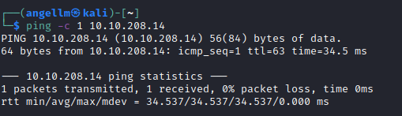

# Paper

**Date**: 21/05/2022

**Difficulty**: EASY

**CTF**: [https://app.hackthebox.com/machines/Paper](https://app.hackthebox.com/machines/Paper)

***

First things first. let’s test the connection with the target machine:

<figure><figcaption></figcaption></figure>

<figure><figcaption></figcaption></figure>

The ttl value of 63 may indicate that the target machine is Linux.

Let’s launch a nmap scan in order to discover the open tcp ports:

<figure><figcaption></figcaption></figure>

There are 3 ports open: 22 (ssh), 80 (http), 443 (https).

Let’s see what is hosted in the http and https ports:

Seems to be the same page.

Wappalizer confirms the versions of apache and openssl. I’m going to search if any of this services has a vulnerability I can use:

Not apparently… Let’s enumerate the directories using wfuzz:

`wfuzz -c --hc 404,403 -L -t 200 -w /usr/share/wordlists/dirbuster/directory-list-2.3-medium.txt <http://10.10.11.143/FUZZ`>

Looks like a standard page…

Ok, no clues. Let’s go back and see what we found so far…

Taking a look to the whatweb response, there is something that looks like a domain… `office.paper` let’s add it to the /etc/hosts file and take a look to it in the web browser:

Yeah, there is a website here!

This site is using Wordpress 5.2.3

Let’s take a look to the page content…

The post says that the only user in the blog is `Prisonmike`, but another user (`nick`) replied telling him that he has secret information in the blog drafts. If we gain access to the administration panel we should take a look to the drafts.

There is nothing interesting in the other 2 post available, but we can find other 2 posts if we click on `Search` button:

A simple test post and another one of Nick reminding him to not write secrets in the drafts.

We didn’t found anything that could be a password for Prisonmike user, so let’s try to login with default credentials:

`admin` is not a valid user, but `prisonmike` is. But we still don’t know the password.

Using searchsploit I found a exploit that seems capable of view unauthenticated posts…

Let’s try it!

So, yeah, we have access to the draft posts contents… There is one with a “secret” url that seems interesting… Let’s add `chat.office.paper` to /ect/hosts file and visit it with the web-browser

It is a register page, let’s register a new user:

Automatically I get invited to a chat:

Let’s take a look to the chat messages:

So, let’s open a private chat with Recyclops and see if we can enumerate something:

Let’s see if it’s vulnerable to path traversal:

Yep, it is… and we should have access to user flag this way:

Not that easy… yep, it is only readable by the owner… there will a ssh key?

Nope… but the .hubot\_history sounds interesting:

There is a connect command? I tried to use it, but it doesn’t seems to work.

woah, we found credentials: `recyclops:Queenofblad3s!23`

Let’s see if we can login as recyclops in the chat:

Nope, we can’t… Recyclops is a bot made by Dwight… Will him be reusing credentials? Let’s check it via ssh:

Yeah!

Escalation

[i.sh](http://i.sh)

