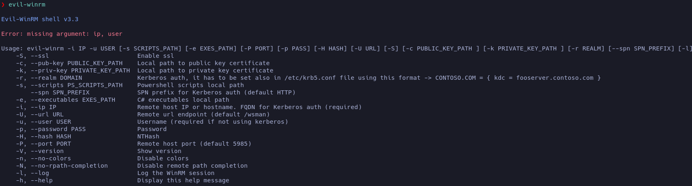
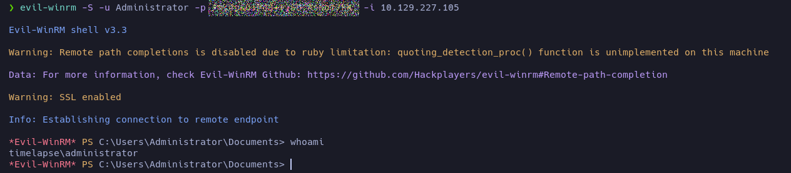

# Timelapse

**Date**: 30/05/2022

**Difficulty**: EASY

**CTF**: [https://app.hackthebox.com/machines/Timelapse](https://app.hackthebox.com/machines/Timelapse)

***

First of all, let’s test the connectivity with the target machine:

<figure><figcaption></figcaption></figure>

ttl = 127 may indicate that the target machine is a Windows machine.

Let’s launch an nmap scan to detect the open TCP ports on the machine:

<figure><figcaption></figcaption></figure>

Wow, the nmap scan reported a lot of open TCP ports… let’s launch a detailed scan in all this ports:

<figure><figcaption></figcaption></figure>

Interesting, we have Kerberos in port 88, ldap, http… and other services.

It catches my eye the details of the http service. The ssl certificate contains `dc01.timelapse.htb`. timelapse.htb sounds like a domain and dc01 as the DomainController01 (Computer Name maybe?). Also, the ldap services detail show the domain timelapse.htb0.

<figure><figcaption></figcaption></figure>

Let’s add the timelapse.htb domain to /etc/hosts and take a look to the webpage:

<figure><figcaption></figcaption></figure>

<figure><figcaption></figcaption></figure>

Nothing useful there…

Let’s take a look to ports 135 and 445 (smb):

<figure><figcaption></figcaption></figure>

<figure><figcaption></figcaption></figure>

Mmm… we have READ permissions on IPC and Shares. Let’s take a look inside:

<figure><figcaption></figcaption></figure>

<figure><figcaption></figcaption></figure>

Let’s download that zip file to see the content later:

<figure><figcaption></figcaption></figure>

Let’s see the content of the other folder also:

<figure><figcaption></figcaption></figure>

Mmmm… let’s download everything:

<figure><figcaption></figcaption></figure>

Let’s enumerate IPC$ just in case:

<figure><figcaption></figcaption></figure>

I’m not sure if any of this file would be useful, but I’ll keep the list.

Let’s see what was inside the compressed file:

<figure><figcaption></figcaption></figure>

Mmm… the zip is password protected. Maybe we can crack it with John, but before doing that, let’s take a look to the other files:

The .docx files describe the use of a tool called Local Administrator Password Solution that can manage the domain passwords. There is also an .msi installer. Maybe is an application that is installed in the target machine.

Let’s see if we can crack the password of the zip file:

<figure><figcaption></figcaption></figure>

<figure><figcaption></figcaption></figure>

It was very fast! John cracked successfully the zip password. Let’s unzip it:

<figure><figcaption></figcaption></figure>

<figure><figcaption></figcaption></figure>

<figure><figcaption></figcaption></figure>

<figure><figcaption></figcaption></figure>

Okay, so I don’t really know what to do with this file and its password… let’s do a bit of research. In [this page](https://www.ibm.com/docs/en/arl/9.7?topic=certification-extracting-certificate-keys-from-pfx-file) and [this one](https://stackoverflow.com/questions/40399690/enter-pem-pass-phrase-when-converting-pkcs12-certificate-into-pem) it’s explained how to extract the keys and certificates from the PFX file.

<figure><figcaption></figcaption></figure>

<figure><figcaption></figcaption></figure>

Now, let’s see what can we do with this certificate and key… First of all we have to clean the certificate and key files:

<figure><figcaption></figcaption></figure>

<figure><figcaption></figcaption></figure>

Apparently we can use the certificate and key to connect to the target machine via SSL using evil-winrm:

<figure><figcaption></figcaption></figure>

<figure><figcaption></figcaption></figure>

<figure><figcaption></figcaption></figure>

<figure><figcaption></figcaption></figure>

<figure><figcaption></figcaption></figure>

<figure><figcaption></figcaption></figure>

<figure><figcaption></figcaption></figure>

Let’s try with an obfuscated version of winPEAS:

<figure><figcaption></figcaption></figure>

Being unable to use winPEAS, let’s enumerate the machine manually:

<figure><figcaption></figcaption></figure>

<figure><figcaption></figcaption></figure>

<figure><figcaption></figcaption></figure>

```bash
whoami
ipconfig /all
netstat -ano |select-string LIST
$so = New-PSSessionOption -SkipCACheck -SkipCNCheck -SkipRevocationCheck
$p = ConvertTo-SecureString 'E#################V' -AsPlainText -Force
$c = New-Object System.Management.Automation.PSCredential ('svc_deploy', $p)
invoke-command -computername localhost -credential $c -port 5986 -usessl -
SessionOption $so -scriptblock {whoami}
get-aduser -filter * -properties *
exit
```

let’s execute the same commands:

<figure><figcaption></figcaption></figure>

Now we can execute commands as svc\_deploy user… Let’s check the privs of svc\_deploy user:

<figure><figcaption></figcaption></figure>

<figure><figcaption></figcaption></figure>

This users is member of LAPS\_Readers group…

<figure><figcaption></figcaption></figure>

We can see that the admin password of DC01!

With this credentials, let’s try to log as Administrator using evil-winrm:

<figure><figcaption></figcaption></figure>

And after some navigation we found the root flag:

<figure><figcaption></figcaption></figure>
