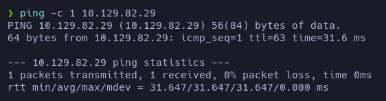
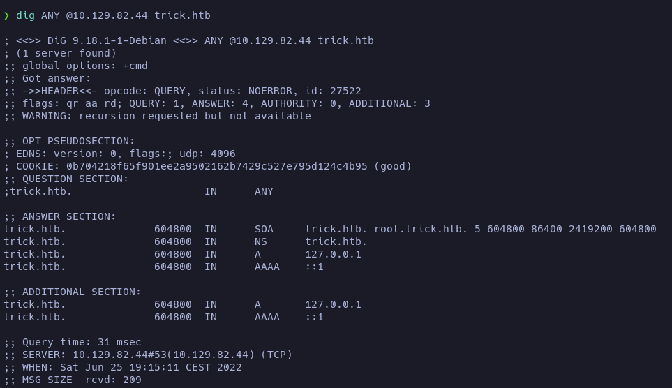
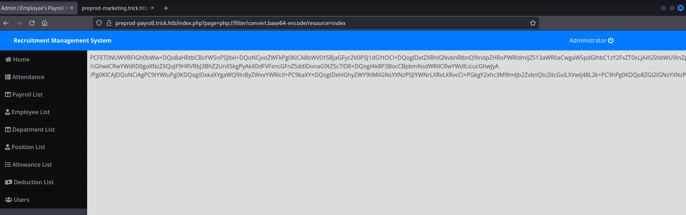
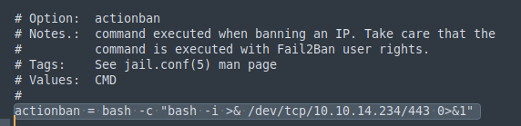

# Trick

**Date**: 25/06/2022

**Difficulty**: Easy

**CTF**: [https://app.hackthebox.com/machines/Trick](https://app.hackthebox.com/machines/Trick)

---

Let’s start checking the connection with the target machine:

<figure><figcaption></figcaption></figure>

Let’s do an nmap scan to discover opened TCP ports:

<figure><figcaption></figcaption></figure>

<figure><figcaption></figcaption></figure>

Let’s take a look to the http service:

<figure><figcaption></figcaption></figure>

<figure><figcaption></figcaption></figure>

Does the form works?

<figure><figcaption></figcaption></figure>

<figure><figcaption></figcaption></figure>

Apparently no.

Let’s try to found directories in the website:

<figure><figcaption></figcaption></figure>

<figure><figcaption></figcaption></figure>

We obtain a 403 error when we try to see that directories.

Let’s see if we can obtain the DNS from the domain service:

<figure><figcaption></figcaption></figure>

Yeah, the DNS is trick.htb, let’s add it to the /etc/hosts file:

<figure><figcaption></figcaption></figure>

<figure><figcaption></figcaption></figure>

The website looks the same, but now we can enumerate for subdomains:

<figure><figcaption></figcaption></figure>

Nothing for the top1million-5000.txt neither for 20000 one.

Let’s see what can we do with the port 25 (SMTP):

<figure><figcaption></figcaption></figure>

Let’s enumerate the DNS:

[https://book.hacktricks.xyz/network-services-pentesting/pentesting-dns](https://book.hacktricks.xyz/network-services-pentesting/pentesting-dns)

<figure><figcaption></figcaption></figure>

<figure><figcaption></figcaption></figure>

We got a total of 3 subdomains:

- `trick.htb`
- `root.trick.htb`
- `preprod-payroll.trick.htb`

Let’s add them to /etc/hosts and visit them.

`root.trick.htb` goes to the same page as `trick.htb`

But preprod goes to this page:

<figure><figcaption></figcaption></figure>

<figure><figcaption></figcaption></figure>

I tried with some common credentials with no success. The error message will not be helpful to enumerate valid usernames, let’s check if it vulnerable to SQLi

<figure><figcaption></figcaption></figure>

<figure><figcaption></figcaption></figure>

Yes, it is. Now we are inside a control panel.

<figure><figcaption></figcaption></figure>

So, apparently the Administrator username is `Enemigosss`. We can edit the profile:

<figure><figcaption></figcaption></figure>

The value of the password field can be seen in cleartext if we inspect the code, but we can also see it in the form if we delete the attribute `type=password` from the textbox:

<figure><figcaption></figcaption></figure>

So, we have credentials.

Let’s see if they have reused them and we can log in via ssh:

<figure><figcaption></figcaption></figure>

Nope.

Ok, it was a preprod of payroll website… Maybe there will be other preprod sites? Let’s find out:

<figure><figcaption></figcaption></figure>

Yeah, at least there is a marketing preprod. Let’s add it to the /etc/hosts file and visit it:

<figure><figcaption></figcaption></figure>

<figure><figcaption></figcaption></figure>

It seems to be including the pages via inclussion… LFI maybe?

<figure><figcaption></figcaption></figure>

It doesn’t allow us to incluse de /etc/passwd file, maybe we cannot use this way.

Let’s try to discover directories for this subdomain:x.php?page=index.php

<figure><figcaption></figcaption></figure>

Going a step back, I found a LFI in the preprod-payroll website. Using the php filter wrapper I’m able to leak the content of certain things encoding it to b64:

`php://filter/convert.base64-encode/resource=index`

<figure><figcaption></figcaption></figure>

There are interesting things here:

<figure><figcaption></figcaption></figure>

This is how it includes the pages, it looks for the `page` parameter and it adds the `.php` file extension. If we want to include other kind of files, we should find the manner to avoid the file extension.

<figure><figcaption></figcaption></figure>

This part of the code is interesting because it leaks some php files. `auth.php` may contain credentials? Let’s take a look:

`http://preprod-payroll.trick.htb/index.php?page=php://filter/convert.base64-encode/resource=auth`

<figure><figcaption></figcaption></figure>

Apparently it doesn’t exists.

Let’s take a look to `users.php`:

<figure><figcaption></figcaption></figure>

Apparently it query the users from a database. To do it, it includes a php file called `db_connect` let’s check it:

<figure><figcaption></figcaption></figure>

So… more credentials, let’s add it to the credentials list. 

<figure><figcaption></figcaption></figure>

This credentials are not valid for ssh neither.

After trying some techniques to try path traversal I haven’t found a valid way to do it. So let’s investigate the preprod-marketing site:

The version of jquery (3.4.1) is vulnerable to XSS:

<figure><figcaption></figcaption></figure>

The only input I have found on the website is this contact form. 

<figure><figcaption></figcaption></figure>

So, I deployed a http server in my machine, listening on port 80 and tried to catch a get, with no success.

There is another strange thing, the URL:

<figure><figcaption></figcaption></figure>

It looks like the LFI we exploited earlier, but the wrappers doesn’t work. Let’s try path traversal…

<figure><figcaption></figcaption></figure>

Yeah! At first I had no success, because probably the server is filtering the string `../` so, using `....//` instead solved the problem.

At `passwd` file we can see a user named `michael`. Let’s try to connect via ssh using this username and the passwords obtained before:

<figure><figcaption></figcaption></figure>

Nope.

Let’s try to catch the flag using the LFI:

<figure><figcaption></figcaption></figure>

Flag found.

But we need to gain access! Let’s see if this user has some ssh credentials:

<figure><figcaption></figcaption></figure>

Bingo!

<figure><figcaption></figcaption></figure>

Yay! We’re inside >:D

Now let’s find the way to escalate privileges

<figure><figcaption></figcaption></figure>

<figure><figcaption></figcaption></figure>

<figure><figcaption></figcaption></figure>

<figure><figcaption></figcaption></figure>

<figure><figcaption></figcaption></figure>

<figure><figcaption></figcaption></figure>

<figure><figcaption></figcaption></figure>

<figure><figcaption></figcaption></figure>

To test it, I executed pspy in the target machine and tried to access via ssh with root username and a random password several times:

<figure><figcaption></figcaption></figure>

After some tries, this happened:

<figure><figcaption></figcaption></figure>

Looking for the file that executes the iptables command I found the file `iptables-multiport.conf`, inside there is something called `actionban`

<figure><figcaption></figcaption></figure>

It’s the iptables command we saw earlier. So, let’s try to modify this, restart the service and trigger the ban to see if we can gain a revshell!

<figure><figcaption></figcaption></figure>

<figure><figcaption></figcaption></figure>

<figure><figcaption></figcaption></figure>

And that’s how I got the root flag!