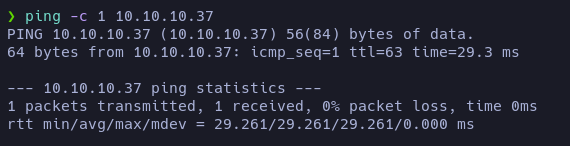

# Pilgrimage

[Pilgrimage](https://app.hackthebox.com/machines/Pilgrimage) is an **EASY** machine from the Hack The Box platform. In it we will discover a **exposed git folder** in the http server. By examining the web page and the repository files, we will find a way to exploit a vulnerability in a **binary** used by the web to perform an **LFI** and thus view the contents of a database. In it we will find the credentials of a user that we will use to gain access to the system. Finally we will use a known vulnerability for a **binary** that is called by a **process** executed by root to elevate our privileges.

***

## Enumeration 

Let’s start by scanning with **nmap** the TCP ports of the target machine:

`nmap -p- -sS --min-rate 5000 10.10.11.219 -n -Pn -vvv -oG allPorts`

<figure><figcaption></figcaption></figure>

**nmap** reports that ports 22(ssh) and 80(http) of the target machine are open.

Let’s perform a more exhaustive scan of these ports to see if we can find out the service and version running on each of them:

`nmap -p22,80 -sCV 10.10.11.219 -oN targeted`

<figure><figcaption></figcaption></figure>

It appears that the **OpenSSH** service is running on port 22. If we look up the version on Launchpad, it looks like we are looking at Ubuntu 21.04 Hirsute Hippo.

<figure><figcaption></figcaption></figure>

On the other hand, port 80 is running the **nginx** service (version 1.18.0). In addition, the scan has reported the existence of the domain http://pilgrimage.htb. Let’s add it to our _**/etc/hosts**_ file:

<figure><figcaption></figcaption></figure>

We will repeat the exhaustive scan, as it can sometimes yield extra information if the necessary domains are added.

<figure><figcaption></figcaption></figure>

Well indeed, the scan now reports the .git directory, something that can become quite critical. Let’s use the **git-dumper** utility to download all the files from this exposed repository:

`git-dumper http://pilgrimage.htb/ git`

<figure><figcaption></figcaption></figure>

<figure><figcaption></figcaption></figure>

o far we have downloaded the files, but we don’t really know what we are dealing with, so it’s about time to list the http service a bit:

`whatweb http://pilgrimage.htb`

<figure><figcaption></figcaption></figure>

The **whatweb** tool has not provided us with any remarkable information, so we are going to view the page using the web browser.

<figure><figcaption></figcaption></figure>

At first glance we see what looks like a form to upload files. And the content gives us to understand that it is an image hosting page.\
In the source code of the page we found nothing useful. Let’s navigate through the different sections of the page:

<figure><figcaption></figcaption></figure>

<figure><figcaption></figcaption></figure>

Let’s register a user:

<figure><figcaption></figcaption></figure>

Apparently now we have at our disposal a Dashboard where, presumably, the images we upload will appear.

Let’s do an upload test:

<figure><figcaption></figcaption></figure>

<figure><figcaption></figcaption></figure>

Will it let us upload any type of file? Let’s try uploading a **php** file that returns a **reverse shell**:

<figure><figcaption></figcaption></figure>

<figure><figcaption></figcaption></figure>

Well no, it seems that it only works by uploading images.

It is possible that the repository we downloaded earlier contains the files from this web page. If so, we could see why it is not letting us upload the .php file and, thus, we may find a way to force the upload.

<figure><figcaption></figcaption></figure>

<figure><figcaption></figcaption></figure>

From what we can see in the code of the index.php file, a command using the magick binary is being executed. Let’s try it and see what it is:

<figure><figcaption></figcaption></figure>

Apparently it is the binary of a program called ImageMagick and the version is 7.1.0-49. We will look to see if there are any known exploits for this version of this binary:

<figure><figcaption></figcaption></figure>

<figure><figcaption></figcaption></figure>

We see that there is a vulnerability registered for this version of ImageMagick. Let’s take a look at the PoC instructions:

https://github.com/voidz0r/CVE-2022-44268

<figure><figcaption></figcaption></figure>

Let’s follow the steps below to see if we can extract the information from /etc/passwd on the target machine:

<figure><figcaption></figcaption></figure>

<figure><figcaption></figcaption></figure>

<figure><figcaption></figcaption></figure>

<figure><figcaption></figcaption></figure>

Yes, we have succeeded. We can see that there are two users with a bash: **root** and **emily**.

If we investigate in the rest of the files, we see that in the **dashboard.php** there is a mention of a Sqlite database located in /var/db/pilgrimage.\
If we perform the same steps, but this time to reveal the contents of this database we can see the following:

<figure><figcaption></figcaption></figure>

`emily:aXXXXXXXXXXXX3`

We can try logging into the site with these credentials:

<figure><figcaption></figcaption></figure>

And we can also try to connect as this user via SSH:

<figure><figcaption></figcaption></figure>

It seems that the credentials are valid and we are logged in as the user emily.

<figure><figcaption></figcaption></figure>

We check that we are indeed on the target machine and find the user flag.

<figure><figcaption></figcaption></figure>

When looking at the OS version, it seems that we had not guessed right before, since it is a Debian 11.

## Privilege Escalation 

Now, let’s see how we can escalate our privileges.

<figure><figcaption></figcaption></figure>

The user emily does not have sudo permissions and there is no SUID binary we can take advantage of.

Let’s list the processes that are running on the system, see if we find any that we can use.

<figure><figcaption></figcaption></figure>

<figure><figcaption></figcaption></figure>

There is a process called malwarescan.sh that runs every time an image is uploaded.

Let’s see its content:

<figure><figcaption></figcaption></figure>

It looks like is using a binary called Binwalk. Let’s see what it is:

<figure><figcaption></figcaption></figure>

Is there an exploit for this?

<figure><figcaption></figcaption></figure>

<figure><figcaption></figcaption></figure>

Yes. If we follow the instructions, it looks like we can get a reverse shell as root:

<figure><figcaption></figcaption></figure>
