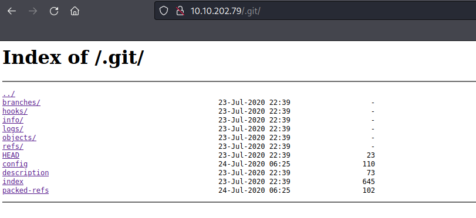

# GitHappens

## Git Happens - Writeup

**Date**: 26/03/2022

**Difficulty**: Medium

**CTF**: [https://tryhackme.com/room/githappens](https://tryhackme.com/room/githappens)

***

Boss wanted me to create a prototype, so here it is! We even used something called "version control" that made deploying this really easy!

## Can you find the password to the application?

First thing first, let’s do a nmap scan of the target to discover open ports:

<figure><figcaption></figcaption></figure>

Okay, it looks like it’s hosting a website on port 80. Let’s use the web brower to see it:

<figure><figcaption></figcaption></figure>

The main page has a login form. Let’s launch a gobuster scan to see if there are any other interesting files or directories we can visit:

<figure><figcaption></figcaption></figure>

Meanwhile let’s check the source code of the main page:

<figure><figcaption></figcaption></figure>

There is a very obfuscated script declaration, but there is not anything human-readable that catches my attention.

<figure><figcaption></figcaption></figure>

Back in gobuster, it discovered the css folder and a dashboard page. Let’s chem them:

<figure><figcaption></figcaption></figure>

The style.css has nothing interesting inside. And the dashboard.html redirect us to the index.html page.

So, as the gobuster didn’t find anything else in the last 5 minutes, let’s stop it and start playing with the webpage.

<figure><figcaption></figcaption></figure>

The website have not created any cookie yet.

<figure><figcaption></figcaption></figure>

And it didn’t load any file except of a failed get of the favicon.

Let’s check wat happens when we try to log in using a random username and password: `admin:admin`

<figure><figcaption></figcaption></figure>

Nothing happens when we click the login Button.

Let’s use Burp Suite to intercept the communications and see what’s going there:

Login Button seems to do nothing with those credentials... Let’s look again at the obfuscated script we saw earlier:

<figure><figcaption></figcaption></figure>

That variable is storing an array of strings that maybe will be valuable, let’s take note of it.

Let’s try to de-obfuscate the script to try to make it more human readable... I’ll use the [http://www.jsnice.org/](http://www.jsnice.org/) tool:

```jsx
'use strict';
const _0x4368 = ["+( +[^", "471197", "value", "RegExp", "functi", "test", "CbRnH", "passwo", "userna", "TML", "tml", "a865c5", "+[^ ]}", "a5f298", "cookie", "admin", "3a71fd", "getEle", "login-", "^([^ ]", "TEhxP", "href", "f64cb3", "51a151", "d84319", "D USER", "digest", "R PASS", "oard.h", "error", " ]+)+)", "19a3c0", "f80f67", "/dashb", "bea070", "3ec9cb", "padSta", "from", "4004c2", "WORD!", "map", "NAME O", "encode", "INVALI", "a5106e", "baf89f", "6a7c7c", "elemen", "9a88db", "log", "join", 
"innerH", "SaltyB", "apply", "ned", "442a9d", "mentBy"];
(function(params, data) {
  const fn = function(selected_image) {
    for (; --selected_image;) {
      params["push"](params["shift"]());
    }
  };
  const build = function() {
    const target = {
      "data" : {
        "key" : "cookie",
        "value" : "timeout"
      },
      "setCookie" : function(value, name, params, headers) {
        headers = headers || {};
        let cookie = name + "=" + params;
        let _0x18026e = 0;
        for (let j = 0, jj = value["length"]; j < jj; j++) {
          const domain = value[j];
          cookie = cookie + ("; " + domain);
          const path = value[domain];
          value["push"](path);
          jj = value["length"];
          if (path !== !![]) {
            cookie = cookie + ("=" + path);
          }
        }
        headers["cookie"] = cookie;
      },
      "removeCookie" : function() {
        return "dev";
      },
      "getCookie" : function(match, href) {
        match = match || function(canCreateDiscussions) {
          return canCreateDiscussions;
        };
        const matches = match(new RegExp("(?:^|; )" + href["replace"](/([.$?*|{}()[]\/+^])/g, "$1") + "=([^;]*)"));
        const decode = function(input, isBinaryData) {
          input(++isBinaryData);
        };
        return decode(fn, data), matches ? decodeURIComponent(matches[1]) : undefined;
      }
    };
    const init = function() {
      const B713 = new RegExp("\\w+ *\\(\\) *{\\w+ *['|\"].+['|\"];? *}");
      return B713["test"](target["removeCookie"]["toString"]());
    };
    target["updateCookie"] = init;
    let start = "";
    const _0xad377 = target["updateCookie"]();
    if (!_0xad377) {
      target["setCookie"](["*"], "counter", 1);
    } else {
      if (_0xad377) {
        start = target["getCookie"](null, "counter");
      } else {
        target["removeCookie"]();
      }
    }
  };
  build();
})(_0x4368, 230);
const _0x2c28 = function(url, whensCollection) {
  /** @type {number} */
  url = url - 0;
  let _0x2c2818 = _0x4368[url];
  return _0x2c2818;
};
const _0x22f4a3 = function() {
  let y$$ = !![];
  return function(value, _b6) {
    if (_0x2c28("0x4") === _0x2c28("0x4")) {
      const voronoi = y$$ ? function() {
        if (_0x2c28("0x12") !== _0x2c28("0x12")) {
          /**
           * @return {undefined}
           */
          var syncDown = function() {
            document[_0x2c28("0xf") + _0x2c28("0x36") + "Id"](_0x2c28("0x1b"))["innerH" + _0x2c28("0x7")] = _0x2c28("0x29") + _0x2c28("0x17") + "NAME O" + _0x2c28("0x19") + _0x2c28("0x25");
          };
        } else {
          if (_b6) {
            const fn3 = _b6[_0x2c28("0x33")](value, arguments);
            return _b6 = null, fn3;
          }
        }
      } : function() {
      };
      return y$$ = ![], voronoi;
    } else {
      /**
       * @return {?}
       */
      var storeOffline = function() {
        const voronoi = y$$ ? function() {
          if (_b6) {
            const fn3 = _b6[_0x2c28("0x33")](value, arguments);
            return _b6 = null, fn3;
          }
        } : function() {
        };
        return y$$ = ![], voronoi;
      };
    }
  };
}();
const _0x28dc3d = _0x22f4a3(this, function() {
  const _0x5b8de6 = typeof window !== "undefi" + _0x2c28("0x34") ? window : typeof process === "object" && typeof require === _0x2c28("0x2") + "on" && typeof global === "object" ? global : this;
  const gotoNewOfflinePage = function() {
    const _0x1eee2f = new (_0x5b8de6[_0x2c28("0x1")])(_0x2c28("0x11") + _0x2c28("0x37") + _0x2c28("0x1c") + _0x2c28("0xa"));
    return !_0x1eee2f[_0x2c28("0x3")](_0x28dc3d);
  };
  return gotoNewOfflinePage();
});
_0x28dc3d();
/**
 * @return {undefined}
 */
async function login() {
  let providerSchema = document[_0x2c28("0xf") + _0x2c28("0x36") + "Id"](_0x2c28("0x10") + "form");
  console[_0x2c28("0x2f")](providerSchema[_0x2c28("0x2d") + "ts"]);
  let lastCharLeft = providerSchema[_0x2c28("0x2d") + "ts"][_0x2c28("0x6") + "me"][_0x2c28("0x0")];
  let firstCharRight = await digest(providerSchema[_0x2c28("0x2d") + "ts"][_0x2c28("0x5") + "rd"][_0x2c28("0x0")]);
  if (lastCharLeft === _0x2c28("0xd") && firstCharRight === _0x2c28("0x24") + _0x2c28("0xe") + "6ba9b0" + _0x2c28("0x21") + "7eed08" + _0x2c28("0x38") + _0x2c28("0x16") + _0x2c28("0x9") + _0x2c28("0x35") + _0x2c28("0x2c") + _0x2c28("0x20") + "f3cb6a" + _0x2c28("0x2a") + _0x2c28("0x1e") + _0x2c28("0x2e") + _0x2c28("0x2b") + _0x2c28("0x14") + _0x2c28("0x15") + _0x2c28("0xb") + _0x2c28("0x1d") + "94eceb" + "bb") {
    /** @type {string} */
    document[_0x2c28("0xc")] = "login=" + "1";
    window["locati" + "on"][_0x2c28("0x13")] = _0x2c28("0x1f") + _0x2c28("0x1a") + _0x2c28("0x8");
  } else {
    document["getEle" + _0x2c28("0x36") + "Id"](_0x2c28("0x1b"))[_0x2c28("0x31") + _0x2c28("0x7")] = _0x2c28("0x29") + _0x2c28("0x17") + _0x2c28("0x27") + _0x2c28("0x19") + _0x2c28("0x25");
  }
}
/**
 * @param {?} data
 * @return {?}
 */
async function digest(data) {
  const img = new TextEncoder;
  const artistTrack = img[_0x2c28("0x28")](data + (_0x2c28("0x32") + "ob"));
  const outputByteCount = await crypto["subtle"][_0x2c28("0x18")]("SHA-51" + "2", artistTrack);
  const _0x558ac0 = Array[_0x2c28("0x23")](new Uint8Array(outputByteCount));
  const outData = _0x558ac0[_0x2c28("0x26")]((canCreateDiscussions) => {
    return canCreateDiscussions["toStri" + "ng"](16)[_0x2c28("0x22") + "rt"](2, "0");
  })[_0x2c28("0x30")]("");
  return outData;
}
;
```

I’m not sure I can exploit this... so let’s look at the webpage again:

Wappalizzer addon shows us this info:

<figure><figcaption></figcaption></figure>

The server is running on Nginx 1.14.0.

After some searching, I’ve found a vulnerability that affects this version of Nginx: [https://mailman.nginx.org/pipermail/nginx-announce/2013/000125.html](https://mailman.nginx.org/pipermail/nginx-announce/2013/000125.html)

<figure><figcaption></figcaption></figure>

Maybe we can scan again the webpage taking advantage of this vulnerability:

<figure><figcaption></figcaption></figure>

after not finding nothing new I tried to scan with the common.txt wordlist:

<figure><figcaption></figcaption></figure>

And a .git folder did appear. Note that the vulnerability that I found earlier has nothing to do with this discover, as the .git folder appears to be non restricted to access:

<figure><figcaption></figcaption></figure>

Navigating through this index, I found some interesting:

<figure><figcaption></figcaption></figure>

At /logs/ subfolder, I found the HEAD file. This file is usually a log that contains the activity of the repository. There is a username there (hydragyrum) and what it seems to be the password in plain text. Let’s see if it is the password that the CTF is asking for. Nope.

Maybe we should find a way to download the repository files in any way...

According to thus website [https://medium.com/swlh/hacking-git-directories-e0e60fa79a36](https://medium.com/swlh/hacking-git-directories-e0e60fa79a36) it’s possible to access to the files included in the git repository by reading the config file and decoding SHA1 hashes.

Also, there are automated tools like [https://securityonline.info/gittools/](https://securityonline.info/gittools/) that make this task much easier. I’ll use this one, although I would want to know how it works underneath, so I’ll revisit this later.

<figure><figcaption></figcaption></figure>

<figure><figcaption></figcaption></figure>

Let’s see the current status of the repository.

<figure><figcaption></figcaption></figure>

Let’s see the commit log:

<figure><figcaption></figcaption></figure>

Interesting, the third commit says that they have obfuscated the code, let’s go back to the commit before that one!

<figure><figcaption></figcaption></figure>

In the index.html now we can see the script not obfuscated!

```jsx
<script>
      function login() {
        let form = document.getElementById("login-form");
        console.log(form.elements);
        let username = form.elements["username"].value;
        let password = form.elements["password"].value;
        if (
          username === "****username****" &&
          password === "****password****"
        ) {
          document.cookie = "login=1";
          window.location.href = "/dashboard.html";
        } else {
          document.getElementById("error").innerHTML =
            "INVALID USERNAME OR PASSWORD!";
        }
      }
    </script>
```

The script simply checks that the username and the password have determined values, if them are correct it sets a cookie and redirects us to the dashboard page.

Let’s try to log in with those credentials:

<figure><figcaption></figcaption></figure>

Nothing happens. Let’s create the cookie manually and try to access to dashboard.html

<figure><figcaption></figcaption></figure>

<figure><figcaption></figcaption></figure>

Bingo! Now we can see the content of the dashboard page, saying us that the flag is the password previously discovered. I could have seen this message by reading the dashboard.html file directly:

<figure><figcaption></figcaption></figure>

And that’s it, flag discovered!

**Note**: A detailed nmap scan at the beginning of the attack would have saved me some time I spent enumerating the webpage, my bad:

<figure><figcaption></figcaption></figure>
