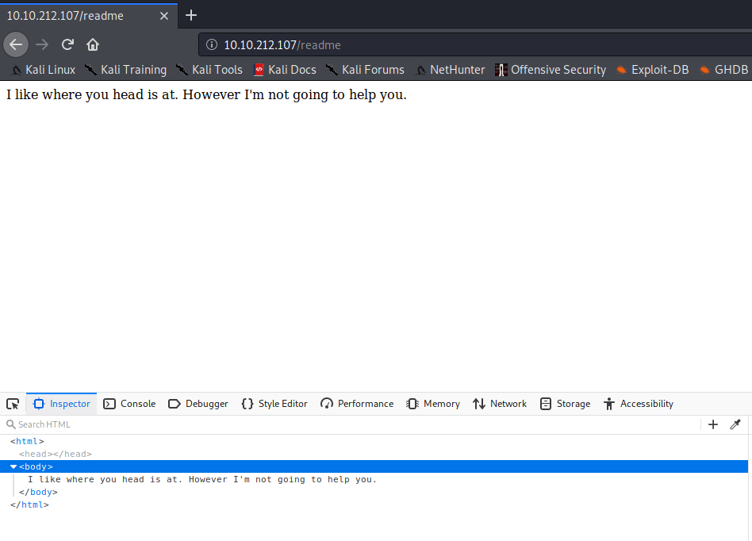
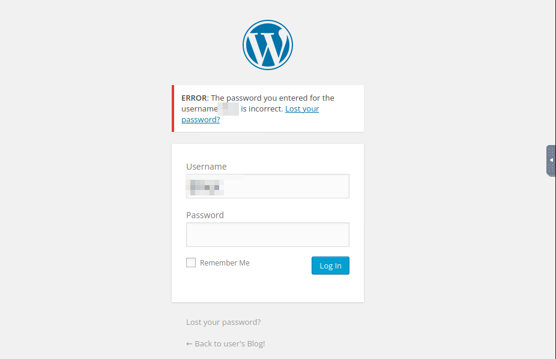
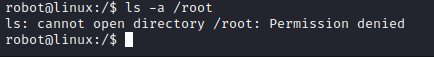

# MrRobot

## Mr. Robot CTF - Writeup

Can you root this Mr. Robot styled machine? This is a virtual machine meant for beginners/intermediate users. There are 3 hidden keys located on the machine, can you find them?

**Date**: 23/03/2022

**Difficulty**: Medium

**CTF**: [https://tryhackme.com/room/mrrobot](https://tryhackme.com/room/mrrobot)

## What is key 1?

First of all, let’s do a quick scan of the open ports of the target:

`sudo nmap -sS -T5 -p- 10.10.212.107 -vvv`

<figure><figcaption></figcaption></figure>

Now let’s get more info about these ports:

`sudo nmap -sV -sC -p22,80,443 10.10.212.107`

<figure><figcaption></figcaption></figure>

The target has a http server running on port 80, let’s visit the IP address with our web browser:

<figure><figcaption></figcaption></figure>

It shows a webpage that looks like a console, let’s see what each command does:

#### prepare

It shows us a video and a link to a webpage: whoismrrobot.com

#### fsociety

It shows a video asking us if we are ready to join fsociety.

#### inform

It shows a bunch of news and mr.robot comment’s

#### question

It shows some images, nothing interesting

#### wakeup

It shows a video.

#### join

After some text, it asks for my mail adress

<figure><figcaption></figcaption></figure>

I’ll enter a fake email:

The text “We’ll be in touch” appears and after that the page returns to the main page.

I’ll fill it again with a real mail (10 minutes mail) just in case it does anything, but I don’t think so.

There is a comment in the source code:

<figure><figcaption></figcaption></figure>

It looks like an ascci multiline text, let’s see if we can reconstruct it to something readable:

Ok, after doing double click over it, it becomes readable:

<figure><figcaption></figcaption></figure>

The website has created some cookies for us:

<figure><figcaption></figcaption></figure>

We have not received any email in the last 10 minutes, so let’s begin with the enumeration of the webpage:

`ffuf -w /usr/share/wordlists/wfuff/general/common.txt -u http://10.10.212.107/FUZZ -L --hs 404`

<figure><figcaption></figcaption></figure>

Wfuzz has discover some interesting folders, lets see what’s inside:

<figure><figcaption></figcaption></figure>

Nothing useful here.

<figure><figcaption></figcaption></figure>

At admin directory, the page is constantly refreshing. We should try to catch the response...

<figure><figcaption></figcaption></figure>

Not useful...

<figure><figcaption></figcaption></figure>

At login, we can see a wordpress login form. Interesting.

<figure><figcaption></figcaption></figure>

I’m not very familiarized with wfuzz, so I’m going to scan the target again using gobuster...

`gobuster dir -u http://10.10.212.107 -w /usr/share/wordlists/SecLists/Discovery/Web-Content/diretory-list-2.3-medium.txt -x html,php,txt`

With the command above, I will try to find html, php and txt files also!

<figure><figcaption></figcaption></figure>

The scan is not finished, but it discovered a pair of txt files that I’ll check:

The license.txt file:

<figure><figcaption></figcaption></figure>

Mr.Robot is not very happy about us discovering some files I guess hahaha

And robots.txt file:

<figure><figcaption></figcaption></figure>

This file is indicating us that there are two files named `fsocity.dic` and `key-1-of-3.txt`, let’s take a look!

<figure><figcaption></figcaption></figure>

Looks like the key we were looking for!

<figure><figcaption></figcaption></figure>

The .dic file has to be downloaded.

## What is key 2?

<figure><figcaption></figcaption></figure>

The fsocity.dic is a dictionary. Maybe we can try to enumerate the website with this dictionary... or maybe it would be used to other things.

It worth a try, so I’ll enumerate the website using gobuster and this dictionary.

Meanwhile, let’s inversigate a little further the join command. It’s supposed to us to introduce an email there but nothing happens after. Let’s user Burp Suite to intercept that communication and investigate it:

<figure><figcaption></figcaption></figure>

It’s a GET petition of the success.txt file, but we are not sending anything...

Let’s intercept the response to this petition:

<figure><figcaption></figcaption></figure>

Nothing useful...

If we try to send something that doesn’t look like an email address this message appears:

<figure><figcaption></figcaption></figure>

So, something is looking to the input...

Looking in the js files loaded by the website, I found this part of the code:

<figure><figcaption></figcaption></figure>

There is the available commands in the help list, except 2 of them: 420 and menu:

<figure><figcaption></figcaption></figure>

Menu does not work as a command.

The gobuster was not discovering nothing new with the .dic found in robots.txt and I’m kinda lost, I had to take a look to the hint: ¨white coloured font¨

Let me check the css files...

After looking to the main css file there is not anything that catches my eye...

Let’s go back to the admin page, we saw that it keeps reloading everytime. Let’s intercept the communications with Burp Suite in order to see what’s happening.

<figure><figcaption></figcaption></figure>

So, the page returned contains a script that apparently is continuously reloading the page (?)

After removing it and forwarding the petition nothing happens... seems like a wrong path.

Ok, after being lost again, I had to look to the official Walkthrough... The next step is forcing the Login page.

So, back to the login page:

<figure><figcaption></figcaption></figure>

We don’t know the user or the password... But we have a dictionary. Let’s cross fingers and try to crack it using hydra.

<figure><figcaption></figcaption></figure>

Due to the source code, the username field is named `log` and the password field is named `pwd`. Also, method is `POST`.

Let’s see what message we receive when we try to log in with incorrect credentials:

<figure><figcaption></figcaption></figure>

Now with this data lets build our hydra command:

`hydra -L /root/fsocity.dic -P /root/fsocity.dic 10.10.104.6 http-post-form "/wp-login.php:log=^USER^&pwd=^PASS^:F=Invalid username" -V`

Ok, it sound like a great idea but...

<figure><figcaption></figcaption></figure>

736567315225 possibilities is a large number. As the login form says “Invalid username” when trying to log in with wrong credentials... It would be possible that it shows a different message when trying to log with a correct username and incorrect password? That username would be in the dic downloaded? Let’s se...

`hydra -L /root/fsocity.dic -p wrongpassword 10.10.104.6 http-post-form "/wp-login.php:log=^USER^&pwd=^PASS^:F=Invalid username" -V`

<figure><figcaption></figcaption></figure>

It worked. Let’s see what happens if we try to log in using the found username:

<figure><figcaption></figcaption></figure>

So... the password would be on the dic also?

`hydra -l <FOUND USERNAME HERE> -P /root/fsocity.dic 10.10.104.6 http-post-form "/wp-login.php:log=^USER^&pwd=^PASS^:F=ERROR" -V`

<figure><figcaption></figcaption></figure>

After a few minutes and more that 5k tries... maybe the password is not in this file. Let’s check it:

<figure><figcaption></figcaption></figure>

<figure><figcaption></figcaption></figure>

The file contains many words repeated... let’s check how to remove the repeated ones...

<figure><figcaption></figcaption></figure>

Seems like something to do everytime you have a list...

`sort fsocity.dic | uniq > unique.dic`

The process is damn fast. Definitely is something to remember.

<figure><figcaption></figcaption></figure>

<figure><figcaption></figcaption></figure>

The original file had 858160 lines, and the unique values file only 11451 lines... let’s try again!

`hydra -l <FOUND USERNAME HERE> -P /root/unique.dic 10.10.104.6 http-post-form "/wp-login.php:log=^USER^&pwd=^PASS^:F=ERROR" -V`

<figure><figcaption></figcaption></figure>

Hydra found a password for the username, let’s try to log in with these credentials:

<figure><figcaption></figcaption></figure>

We are in! Let’s look around:

<figure><figcaption></figcaption></figure>

No posts.

<figure><figcaption></figcaption></figure>

Let’s check these photos:

<figure><figcaption></figcaption></figure>

Every photo is related to Mr. Robot series except of this one (I think). Maybe is a frame from the series...

<figure><figcaption></figcaption></figure>

No pages but, wait. There is one page in the Trash... And now I realise that there were 5 post also in the trash... let’s look to the page and then I’ll look the posts.

<figure><figcaption></figcaption></figure>

Looks like a standard template, let’s take a look to the posts of the trash:

<figure><figcaption></figcaption></figure>

There are 5 posts. The hello world! Looks like a normal template with a standard wordpress comment. The rest of the post are blank drafts.

Let’s take a look at Users:

<figure><figcaption></figcaption></figure>

Admin user seems pretty normal.

mich05654 user looks normal, except for the biographical info:

<figure><figcaption></figcaption></figure>

Let’s change its password and log in with that user:

<figure><figcaption></figcaption></figure>

<figure><figcaption></figcaption></figure>

Apparently there is not anything new we can do with this account... maybe we can use the mail in the “join” command of the webpage?

<figure><figcaption></figcaption></figure>

Nothing new happens...

Let’s try with the Admin mail just in case.

Nah, the same.

So, as we have access to the admin panel, let’s try to upload a php reverse shell...

<figure><figcaption></figcaption></figure>

<figure><figcaption></figcaption></figure>

The WP system doesn’t allow me to upload a .php as a media file... maybe at plugins?

I tried to edit a plugin and insert the code, but it didn’t work. (Actually it did work).

<figure><figcaption></figcaption></figure>

<figure><figcaption></figcaption></figure>

Other options is generating a brand new plugin, compressing it and uploading it to the plugins ([https://www.sevenlayers.com/index.php/179-wordpress-plugin-reverse-shell](https://www.sevenlayers.com/index.php/179-wordpress-plugin-reverse-shell))

<figure><figcaption></figcaption></figure>

<figure><figcaption></figcaption></figure>

After activating it we received a reverse shell:

<figure><figcaption></figcaption></figure>

<figure><figcaption></figcaption></figure>

We found the file location, but we don’t have permissions to read the key file. But we can read the password.raw-md5 file that looks like a MD5 hash password of robot user. Let’s copy it and try to hack it with John the ripper:

<figure><figcaption></figcaption></figure>

Now, let’s try to switch users to robot:

<figure><figcaption></figcaption></figure>

Ok, it’s not possible with our current reverse shell... lets try the command runuser

<figure><figcaption></figcaption></figure>

Ok, it doesn’t work. I find strange this line I got when the revshell connection was made:

<figure><figcaption></figcaption></figure>

It may be caused by this option trying to get an interactive shell? Let’s replace it with the -m option it and try again...

<figure><figcaption></figcaption></figure>

<figure><figcaption></figcaption></figure>

<figure><figcaption></figcaption></figure>

Looks pretty the same... let’s try to get an interactive console using python:

<figure><figcaption></figcaption></figure>

<figure><figcaption></figcaption></figure>

Yeah! logged as robot! Now we can see the 2nd key file!

<figure><figcaption></figcaption></figure>

## What is key 1?

Let’s go for the final key. Where it would be, I’ll quickly check the /root folder:

<figure><figcaption></figcaption></figure>

We don’t have permissions to see inside root folder. Anyway, let’s discard that it’s in other path... Presumably, the filename will be key-3-of-3.txt if it follows the previous ones... so let’s do a search...

<figure><figcaption></figcaption></figure>

Nothing found, I’m pretty sure that it is in a folder with higher privileged than our current ones... so let’s try to do privesc.

Let’s try it manually first.

What commands we can run using sudo?

<figure><figcaption></figcaption></figure>

Can we read /etc/passwd and /etc/shadow?

<figure><figcaption></figcaption></figure>

There is any cronjob being executed in this machine?

<figure><figcaption></figcaption></figure>

It has some cronjobs, but none of them seems to be exploitable for privesc...

Maybe a login appears in the history?

<figure><figcaption></figcaption></figure>

Nah, it’s all mine.

There is any interesting file with the SUID bit activated?

<figure><figcaption></figcaption></figure>

Nmap can be used to get an elevated shell, let’s try to exploit it.

<figure><figcaption></figcaption></figure>

Easy!

<figure><figcaption></figcaption></figure>

And we got the last key!
