# Overpass3

## Overpass 3 - Writeup

After Overpass's rocky start in infosec, and the commercial failure of their password manager and subsequent hack, they've decided to try a new business venture. Overpass has become a web hosting company!Unfortunately, they haven't learned from their past mistakes. Rumour has it, their main web server is extremely vulnerable.

**Date**: 18/03/2022

**Difficulty**: Medium

**CTF**: [https://tryhackme.com/room/overpass3hosting](https://tryhackme.com/room/overpass3hosting)

***

## Web Flag

First of all, let’s do a common ports nmap scan of the target:

<figure>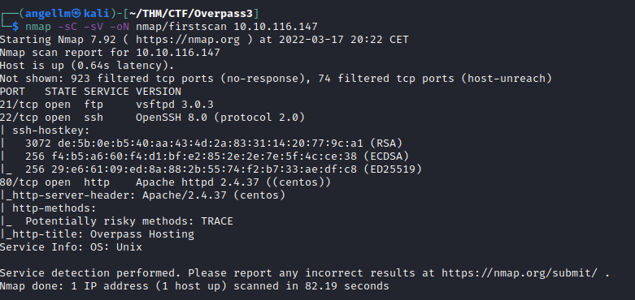<figcaption></figcaption></figure>

We can see that it has ftp, ssh and http services. Let’s see what they are showing in their webpage:

<figure>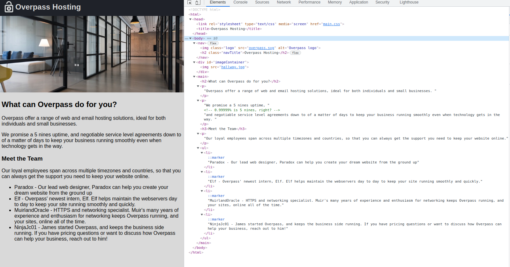<figcaption></figcaption></figure>

The landing page doesn’t show nothing special, let’s scan the website using gobuster:

<figure>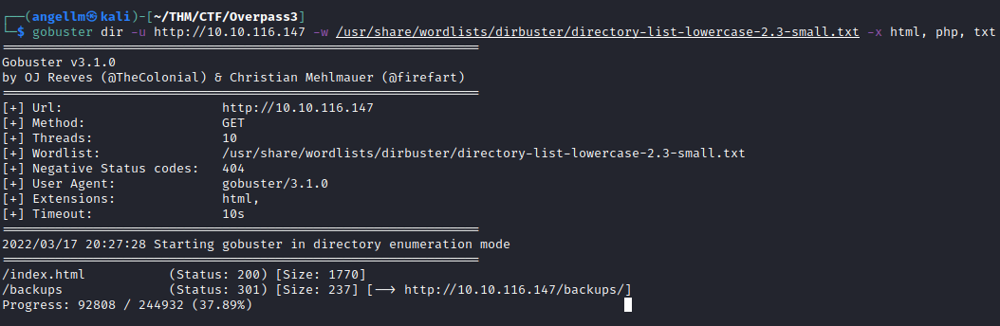<figcaption></figcaption></figure>

There is a folder called “backups”. What would be inside?

<figure>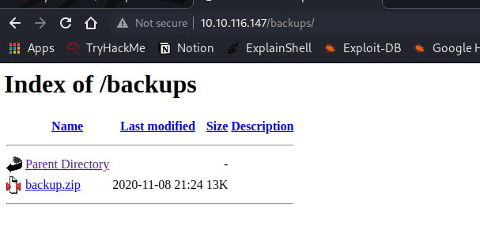<figcaption></figcaption></figure>

Well, wel... I’m going to download that file and see what’s inside:

<figure>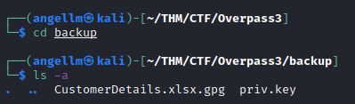<figcaption></figcaption></figure>

There is an Excel file with a strange extension and a key file. I’m gonna search more about “GPG”:

<figure>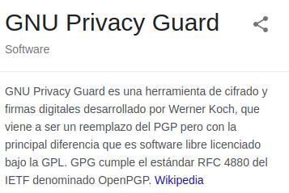<figcaption></figcaption></figure>

Okay, so it seems like the file is encrypted. I guess that I can decrypt it with the key...

<figure>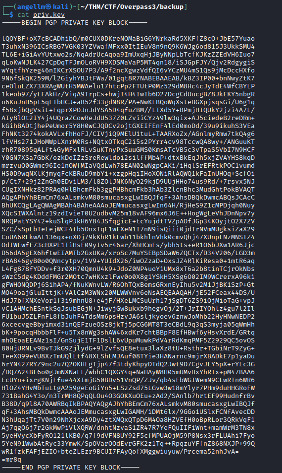<figcaption></figcaption></figure>

But I don’t really know how to gpg works, so let’s search a little bit more: [https://gnupg.org/gph/es/manual.html#AEN27](https://gnupg.org/gph/es/manual.html#AEN27)

<figure>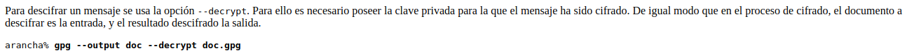<figcaption></figcaption></figure>

<figure>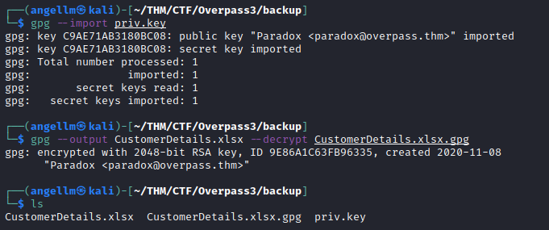<figcaption></figcaption></figure>

<figure>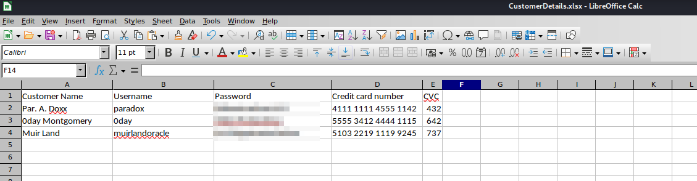<figcaption></figcaption></figure>

Okay, after decrypt the file I open the Excel file using Open Office and I can see usernames, passwords and even credit card credentials.

I have been looking for the flag inside the files of the webpage (images, petitions, source files...) but nothing appears. I guess it’s not there.

Let’s check if we can use the credentials of the Excel file to access the target via ssh or ftp:

<figure>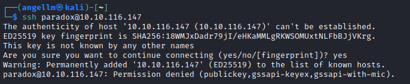<figcaption></figcaption></figure>

It seems that we cannot access via ssh without a key. Let’s check the ftp connection:

<figure>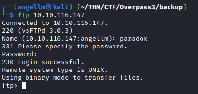<figcaption></figcaption></figure>

Yep, we can access to the ftp server using paradox credentials!

<figure>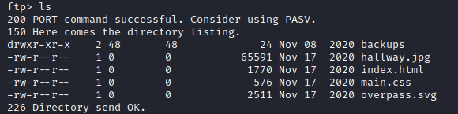<figcaption></figcaption></figure>

This user only has access to the contents of the /backup folder we discover previously... Nothing new here. Before anything else, let’s try the rest of the users credentials:

<figure>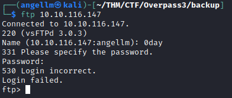<figcaption></figcaption></figure>

<figure>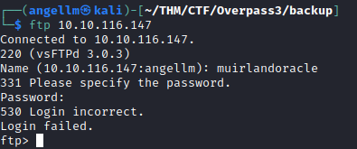<figcaption></figcaption></figure>

Neither the user 0day nor muirlandoracle credentials allow us to access to the ftp.

So, using the paradox ftp credentials I’m going to upload a reverse shell. To do so, I’m going to use the php-reverse-shell.php, so let’s configure the IP address:

<figure>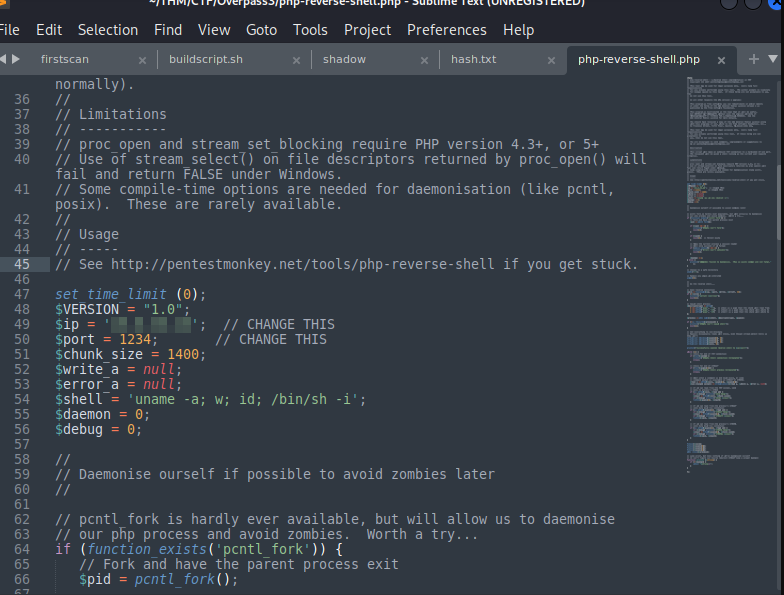<figcaption></figcaption></figure>

And upload it to the server:

<figure>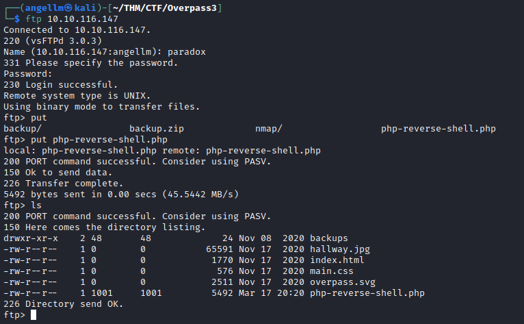<figcaption></figcaption></figure>

Now I open a netcat listener in my machine:

<figure>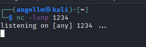<figcaption></figcaption></figure>

And we open the reverse-shell-php file we uploaded to the server in the web-browser:

<figure>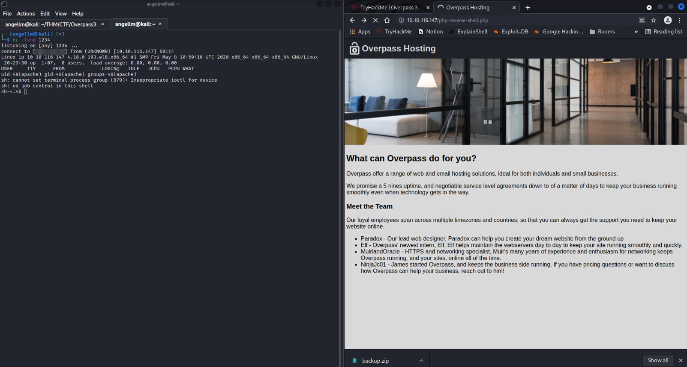<figcaption></figcaption></figure>

Perfect, the connection was established! The user is “apache”.

After some time looking for a folder called “apache” without any success, I have read the /etc/passwd file to see what is the default folder for our user... and it says that the folder is /usr/share/httpd. There I have found the web flag.

<figure>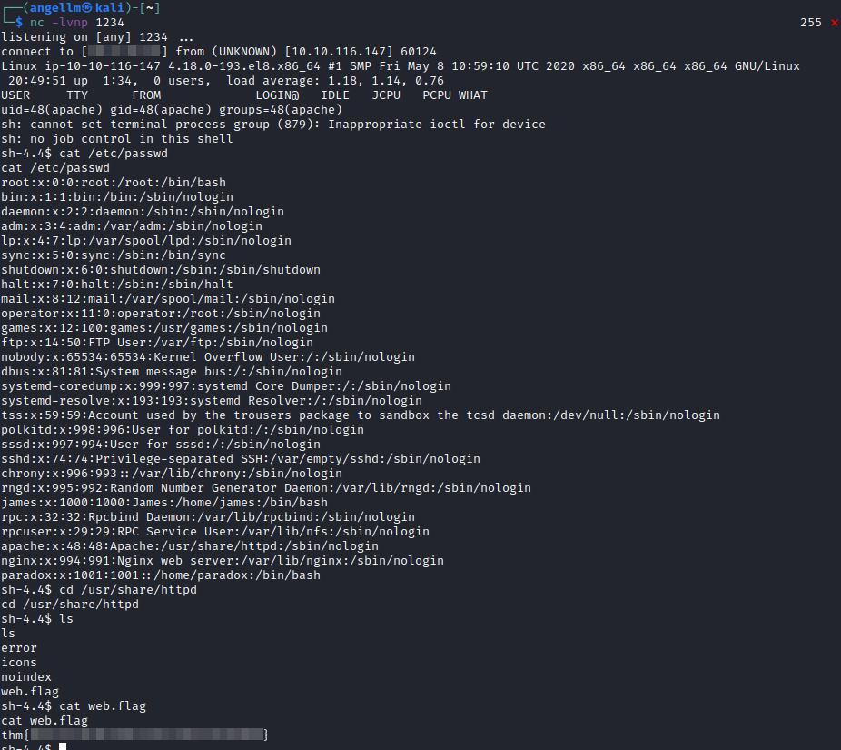<figcaption></figcaption></figure>

### User Flag

I guess that the user we are looking for is james.

I though about trying to switch the user to paradox using `su paradox` as we know its password:

<figure>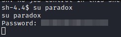<figcaption></figcaption></figure>

It seems to work, but as the reverse shell is not interactive we are not seeing the output... Let’s stabilize the shell.

I’m gonna try it with Python. To do so I’m gonna execute in the revshell:

```jsx
python3 -c 'import pty;pty.spawn("/bin/bash")'
export TERM=xterm
```

After that I send the revshell to the background (Ctrl+Z) and execute in my terminal:

```jsx
stty raw -echo; fg
```

<figure>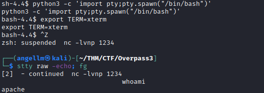<figcaption></figcaption></figure>

Now we should have a stable shell. Let’s try again to switch the user to paradox:

<figure>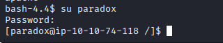<figcaption></figcaption></figure>

Yeah, now we can. Would we have permissions to read the /root folder?

<figure>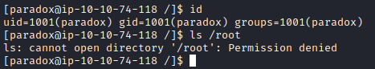<figcaption></figcaption></figure>

Nope. Can we run any command using sudo?

<figure>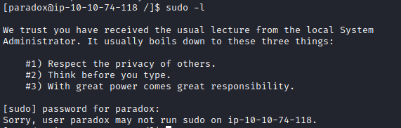<figcaption></figcaption></figure>

Nothing, I’m not going to try to switch users with the other 2 that appear in the excel file as they don’t appear in the /etc/passwd file...

Let’s take a look at the home folder of this user:

<figure>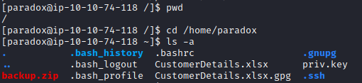<figcaption></figcaption></figure>

Nothing looking useful. The backup file looks like the one we have download previously.

Without any much to do here, let’s start with the enumeration. I’m going to use LinPeas to to it:

<figure>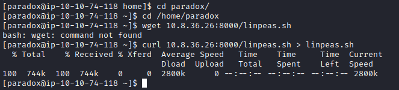<figcaption></figcaption></figure>

<figure>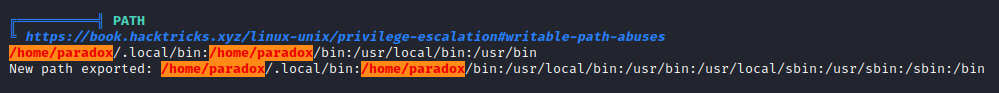<figcaption></figcaption></figure>

First thing catches my eye is that there are some /home/paradox folders in the path. But as there are not conjob and no script with SUID permissions that execute any binary in the path... It is not useful :(

<figure>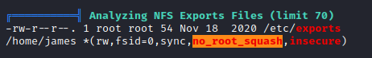<figcaption></figcaption></figure>

The other thing that Linpeas found is that there is an NFS in /home/james with the no\_root\_squash option activated, which is a potential point of entry.

<figure>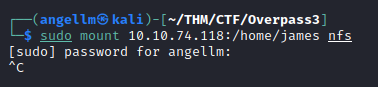<figcaption></figcaption></figure>

<figure>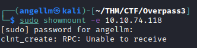<figcaption></figcaption></figure>

I tried to mount the NFS in my machine and it doesn’t work. I also tried to check the connection with the NFS server and it says “Unable to receive”. In the first scan we have not seen any open port dedicated to a NFS server so it may be a local accesible NFS?

<figure>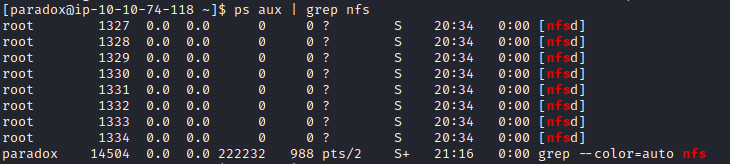<figcaption></figcaption></figure>

Although there are processes of nfsd in execution... So I’m going to scan all the ports of the target to see if it was configurated in a non common port. After a while scanning, no new ports appear.

Up to this point and without a clue about how can I continue I check up a writeup from other user.

Aparently we can use a tecnique named SSH tunneling (SSH Port Forwarding) to stablish a “local connection” between our machine and the target machine. This way we could connect to the locally accesible NFS.

To do it, we would need to connect to the target machine via ssh, so we need to find or create some credentials. Let’s take a look into the paradox .ssh folder:

<figure>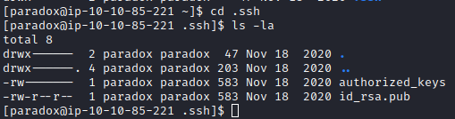<figcaption></figcaption></figure>

There is a public key and the autorized\_keys file, but there is not a private key that we can use, so we can create a new one:

```jsx
ssh-keygen -f paradox
```

<figure>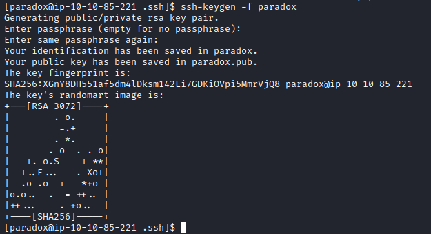<figcaption></figcaption></figure>

Now we have to insert the public key into the authorized\_keys file:

```jsx
cat paradox.pub >> authorized_keys
```

<figure>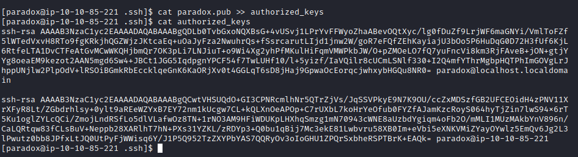<figcaption></figcaption></figure>

No let’s copy the private key content in our local machine:

<figure>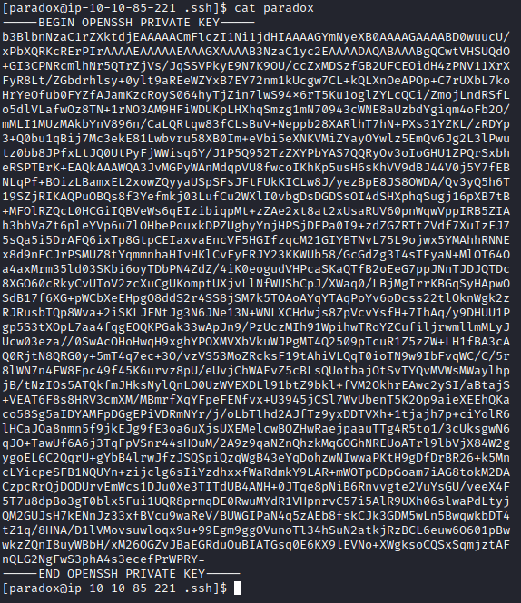<figcaption></figcaption></figure>

<figure>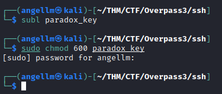<figcaption></figcaption></figure>

And, let’s try to connect via SSH:

<figure>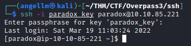<figcaption></figcaption></figure>

Logged in. Now we have to know on wich port is NFS listening...

```jsx
rpcinfo -p
```

<figure>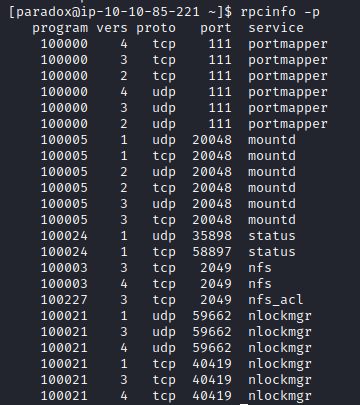<figcaption></figcaption></figure>

Knowing that the NFS port is listening is 2049, we can establish the port forwarding:

```jsx
ssh -i paradox_key paradox@10.10.85.221 -L 2049:localhost:2049
```

<figure>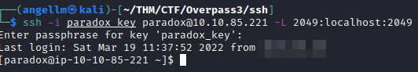<figcaption></figcaption></figure>

Now in a new terminal of our machine, we can try again to mount the NFS:

```jsx
sudo mount -t nfs localhost:/ nfs
```

<figure>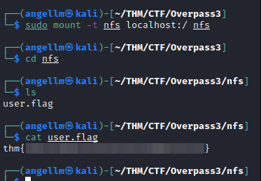<figcaption></figcaption></figure>

## Root flag

To escalate to root privileges, we can create a binary with the SUID bit activated taking advance of our NFS connection:

<figure><figcaption></figcaption></figure>

Now we have to connect to the target using james credentials, so let’s look for the ssh keys of james and copy the private one:

<figure>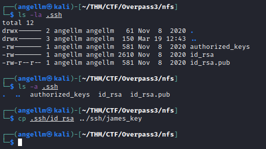<figcaption></figcaption></figure>

Now, let’s access to the target using james credentials via ssh and execute the root binary:

<figure>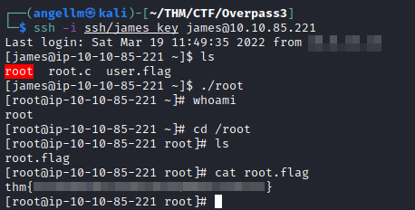<figcaption></figcaption></figure>
