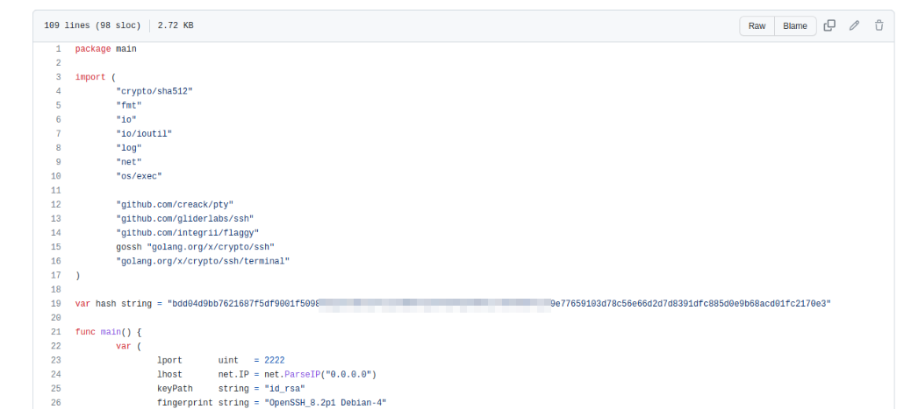

# Overpass2

## Overpass 2 - Writeup

Overpass has been hacked! The SOC team (Paradox, congratulations on the promotion) noticed suspicious activity on a late night shift while looking at shibes, and managed to capture packets as the attack happened.

Can you work out how the attacker got in, and hack your way back into Overpass' production server?

**Date**: 16/03/2022

**Difficulty**: Medium

**CTF**: [https://tryhackme.com/room/overpass2hacked](https://tryhackme.com/room/overpass2hacked)

***

## Forensics - Analyse the PCAP

### What was the URL of the page they used to upload a reverse shell?

First of all I downloaded the file available with this room and open it using Wireshark.

<figure><figcaption></figcaption></figure>

After reading a few registers, it seems like the url used to upload the reverse shell was this one:

<figure><figcaption></figcaption></figure>

### What payload did the attacker use to gain access?

Let’s analyze the POST petition:

<figure><figcaption></figcaption></figure>

After taking a look to the registers, this one seems suspicious:

<figure><figcaption></figcaption></figure>

We can see that the system is asking for a password.

Two registers after, we can see the entered password in clear text:

<figure><figcaption></figcaption></figure>

### How did the attacker establish persistence?

It looks like the hacker has cloned a GitHub repository called ‘’backdoor’:

<figure><figcaption></figcaption></figure>

### Using the fasttrack wordlist, how many of the system passwords were crackable?

The hacker performed a cat /etc/passwd and cat /etc/shadow revealing the following information:

```jsx
root:*:18295:0:99999:7:::
daemon:*:18295:0:99999:7:::
bin:*:18295:0:99999:7:::
sys:*:18295:0:99999:7:::
sync:*:18295:0:99999:7:::
games:*:18295:0:99999:7:::
man:*:18295:0:99999:7:::
lp:*:18295:0:99999:7:::
mail:*:18295:0:99999:7:::
news:*:18295:0:99999:7:::
uucp:*:18295:0:99999:7:::
proxy:*:18295:0:99999:7:::
www-data:*:18295:0:99999:7:::
backup:*:18295:0:99999:7:::
list:*:18295:0:99999:7:::
irc:*:18295:0:99999:7:::
gnats:*:18295:0:99999:7:::
nobody:*:18295:0:99999:7:::
systemd-network:*:18295:0:99999:7:::
systemd-resolve:*:18295:0:99999:7:::
syslog:*:18295:0:99999:7:::
messagebus:*:18295:0:99999:7:::
_apt:*:18295:0:99999:7:::
lxd:*:18295:0:99999:7:::
uuidd:*:18295:0:99999:7:::
dnsmasq:*:18295:0:99999:7:::
landscape:*:18295:0:99999:7:::
pollinate:*:18295:0:99999:7:::
sshd:*:18464:0:99999:7:::
james:$6$7GS5e.yv$HqIH5MthpGWpczr3MnwDHlED8gbVSHt7ma8yxzBM8LuBReDV5e1Pu/VuRskugt1Ckul/SKGX.5PyMpzAYo3Cg/:18464:0:99999:7:::
paradox:$6$oRXQu43X$WaAj3Z/4sEPV1mJdHsyJkIZm1rjjnNxrY5c8GElJIjG7u36xSgMGwKA2woDIFudtyqY37YCyukiHJPhi4IU7H0:18464:0:99999:7:::
szymex:$6$B.EnuXiO$f/u00HosZIO3UQCEJplazoQtH8WJjSX/ooBjwmYfEOTcqCAlMjeFIgYWqR5Aj2vsfRyf6x1wXxKitcPUjcXlX/:18464:0:99999:7:::
bee:$6$.SqHrp6z$B4rWPi0Hkj0gbQMFujz1KHVs9VrSFu7AU9CxWrZV7GzH05tYPL1xRzUJlFHbyp0K9TAeY1M6niFseB9VLBWSo0:18464:0:99999:7:::
muirland:$6$SWybS8o2$9diveQinxy8PJQnGQQWbTNKeb2AiSp.i8KznuAjYbqI3q04Rf5hjHPer3weiC.2MrOj2o1Sw/fd2cu0kC6dUP.:18464:0:99999:7:::
```

Let’s copy the shadow file information into a file in our system and crack it using John the Ripper and the fasttrack wordlist:

<figure><figcaption></figcaption></figure>

## Research - Analyse the code

Now that you've found the code for the backdoor, it's time to analyse it.

### What's the default hash for the backdoor?

First of all, let’s go to the backdoor repository to analyse the code: [https://github.com/NinjaJc01/ssh-backdoor](https://github.com/NinjaJc01/ssh-backdoor)

<figure><figcaption></figcaption></figure>

Inside the code of the main.go file a hash can be found:

<figure><figcaption></figcaption></figure>

### What's the hardcoded salt for the backdoor?

In the same files, this can be found:

<figure><figcaption></figcaption></figure>

Where verifyPass is:

<figure><figcaption></figcaption></figure>

So it belongs to a hardcoded salt.

### What was the hash that the attacker used? - go back to the PCAP for this!

In the top lines of the main.go code, we can se that:

<figure><figcaption></figcaption></figure>

The flag -a is used to customize the hash:

Now, back to Wireshark, let’s see how the hacker ran the backdoor:

<figure><figcaption></figcaption></figure>

### Crack the hash using rockyou and a cracking tool of your choice. What's the password?

As we have seen before in the code, the hash format is sha512.

I’ll try to crack it using John the Ripper, but I don’t remember how to crack salted hashes, so I’ll do a quick research:

[https://miloserdov.org/?p=5960#61](https://miloserdov.org/?p=5960#61)

I create a file named hash.txt which will contain `hash$salt`:

<figure><figcaption></figcaption></figure>

Now I use John with the correct formar to crack the hash:

<figure><figcaption></figcaption></figure>

## Attack - Get back in!

Now that the incident is investigated, Paradox needs someone to take control of the Overpass production server again.

There's flags on the box that Overpass can't afford to lose by formatting the server!

### The attacker defaced the website. What message did they leave as a heading?

Let’s visit the web page:

<figure><figcaption></figcaption></figure>

### Using the information you've found previously, hack your way back in!

I suppose that the username is james, as the hacker has created his own RSA key for this user before:

<figure><figcaption></figcaption></figure>

I have no clues about how I can get that key to connect as the hacker...

In the last line it seems as the hacker has opened a ssh service in port 2222.

<figure><figcaption></figcaption></figure>

I confirmed it using nmap.

Maybe the user is CooctusClan and the password may be the one used to generate the salted hash? It worth a try:

<figure><figcaption></figcaption></figure>

Lol, it is hahaha

### What's the user flag?

After a quick directory listing in the current and the james directories I found it.

<figure><figcaption></figcaption></figure>

### What's the root flag?

As we probably will need root privileges to find that flag, let’s see if we perform privesc:

Can run any command with sudo?

<figure><figcaption></figcaption></figure>

Ok, I forgot that I didn’t know james password... But I have cracked some users password no time ago:

<figure><figcaption></figcaption></figure>

Maybe the hacker has changed the passwords...

Time to look to the crontab:

<figure><figcaption></figcaption></figure>

Nothing to do here.

There are files with the SUID bit activated?

<figure><figcaption></figcaption></figure>

Last one is suspicious, it looks like a copy of bash but with SUID.

<figure><figcaption></figcaption></figure>

And... It is!

Remainder: the option `-p` holds the file owner privileges when running the binary.

<figure><figcaption></figcaption></figure>
