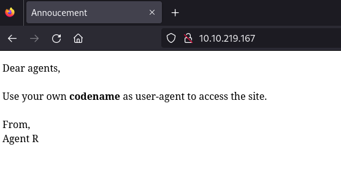

# AgentSudo

## Agent Sudo - Writeup

**Date**: 12/01/2025

**Difficulty**: Easy

**CTF**: [https://tryhackme.com/r/room/agentsudoctf](https://tryhackme.com/r/room/agentsudoctf)

***

You found a secret server located under the deep sea. Your task is to hack inside the server and reveal the truth.

## Enumerate

Let’s start by checking the connection with the machine:

<figure><figcaption></figcaption></figure>

We got the ping back, the TTL has a value of 63 so we are against a Linux machine probably.

Now let’s do a port scan using nmap:

<figure><figcaption></figcaption></figure>

nmap has discovered 3 open ports: 21 (FTP), 22 (SSH) and 80 (HTTP).

Now we can get more info of this ports using nmap:

<figure><figcaption></figcaption></figure>

* port 21 (FTP): vsftpd 3.0.3
* port 22 (SSH): OpenSSH 7.6p1 → Ubuntu Bionic 18.04 (Launchpad)
* port 80 (HTTP): Apache httpd 2.4.29

Let’s take a look to the web page:

<figure><figcaption></figcaption></figure>

Seems like we have to use a “codename” as user-agent. I checked the webpage source code but there is nothing interesting there.

To manipulate the user-agent parameter, I’ll intercept the web petition with BurpSuite and sent it to the Repeater:

<figure><figcaption></figcaption></figure>

When I use “R” as the user-agent, I get this response:

<figure><figcaption></figcaption></figure>

Now we know that there are 25 employees.

Maybe the codename of each agent is a single letter. Let’s send the petition to the Intruder and set the payload:

<figure><figcaption></figcaption></figure>

<figure><figcaption></figcaption></figure>

Now, let’s start the attack:

<figure><figcaption></figcaption></figure>

We can see that the status code of the request with the payload “C” as user-agent is different (302) which means that the page is redirecting us to “agent\_C\_attention.php” page. Let’s take a look:

<figure><figcaption></figcaption></figure>

## Hash cracking and brute-force

Seems to be a message sent by Agent R to Agent C telling him that his password is weak. Knowing that, let’s see if we can guess the password of “chris” username for FTP or SSH services using hydra:

<figure><figcaption></figcaption></figure>

First I tried with the 100 most used passwords dictionary for both FTP and SSH services. After not getting a match, I used the 1000 most common one and… we have a match!

<figure><figcaption></figcaption></figure>

Now we have a valid credentials for the FTP service. Let’s see if it works for SSH also:

<figure><figcaption></figcaption></figure>

Nope, it doesn’t. Let’s take a look to the FTP:

<figure><figcaption></figcaption></figure>

There are some files inside, I downloaded them all.

There are 2 images:

<figure><figcaption></figcaption></figure>

<figure><figcaption></figcaption></figure>

I’ll check the EXIF info just in case:

<figure><figcaption></figcaption></figure>

Nothing seems interesting there.

Let’s check the text file:

<figure><figcaption></figcaption></figure>

So… There is a password and we are being asked for a ZIP password and a steg password… maybe one of this downloaded images has a zip inside it? Let’s use binwalk to investigate them further:

<figure><figcaption></figcaption></figure>

The cute-alien.jpg file seems to be a normal image, but the cuttie.png has something else! Let’s extract it:

<figure><figcaption></figcaption></figure>

If we attempt to decompress the ZIP file, we are asked for a password:

<figure><figcaption></figcaption></figure>

Let’s try to use JohnTheRipper to crack the password. First we have to use **zip2john** tool, and then **john**:

<figure><figcaption></figcaption></figure>

And we get the password! Let’s decompress the ZIP file:

<figure><figcaption></figcaption></figure>

Now we can read another message wrote by Agent R, and a code. It looks weird, so let’s use Cyberchef to check if it is encoded:

<figure><figcaption></figcaption></figure>

Seems to be encoded in Base64, and decoded it shows a clear text.

Let’s try to use it as the password to decode the image cute-alien.jpg using an online tool for steganography:

<figure><figcaption></figcaption></figure>

So, it reveals a message wrote by Chris, telling James its login password, so we now have a new credentials.

Let’s see if we can connect to FTP or SSH using this credentials:

<figure><figcaption></figcaption></figure>

## Capture the user flag

The credentials are not valid for FTP, but they are for SSH! Now we are logged as james at the target machine!

<figure><figcaption></figcaption></figure>

At the home folder of the current user we found the user flag and an image. Let’s download the image using **scp**:

<figure><figcaption></figcaption></figure>

I know that there is something related to the Rosswell incident, but after a reverse image search using tineye website, the photo is called “Rosswell Alien Autopsy”

## Privilege escalation

Now, let’s look for privilege escalation. Let’s check the sudoers first:

<figure><figcaption></figcaption></figure>

It looks interesting, let’s search what does it mean. After a quick search it seems that the user james can execute /bin/bash as any user except as root. It also redircts me to a ExploitDB page, where I can see that there is a vulnerability (CVE-2019-14287) that allows privilege escalation:

<figure><figcaption></figcaption></figure>

> Sudo doesn't check for the existence of the specified user id and executes the with arbitrary user id with the sudo priv -u#-1 returns as 0 which is root's id

As it’s explained on the exploit description, there is a vulnerability where, in this conditions where the active user can execute a bash as any other user except as root, the command `sudo -u#-1 /bin/bash` can be executed to gain a root bash.

<figure><figcaption></figcaption></figure>

That’s how we gain root privileges and the root flag.
