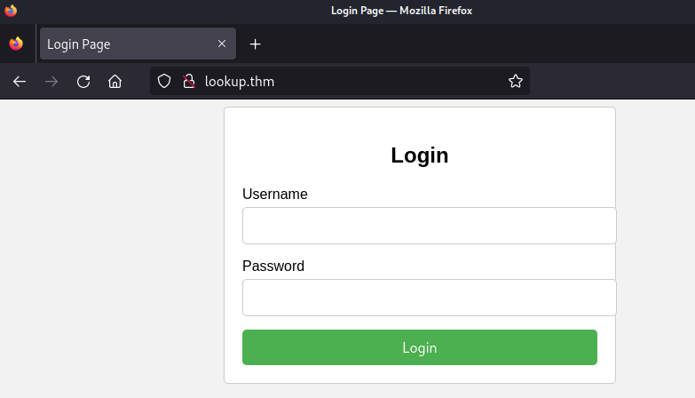
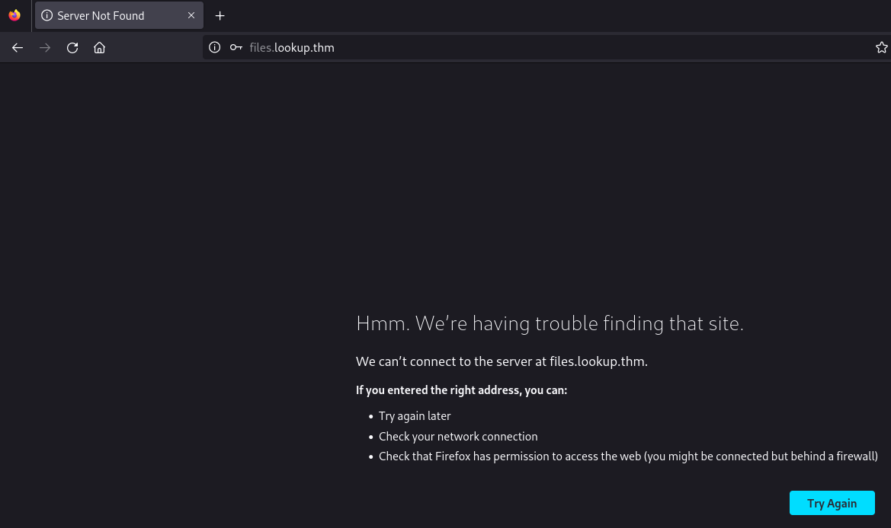
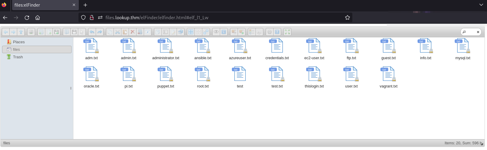
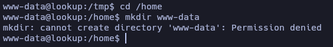
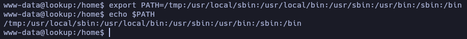

# Lookup - Writeup

**Date**: 23/01/2025

**Difficulty**: Easy

**CTF**: [https://tryhackme.com/r/room/lookup](https://tryhackme.com/r/room/lookup)

Test your enumeration skills on this boot-to-root machine.

---

# Discovery

Let’s start by testing the connection to the target machine using **ping**:

<figure><figcaption></figcaption></figure>

We receive a packet back, and the TTL shows a value of 63, which means that we are probably facing a Linux Machine.

Let’s use **nmap** tool to search for open TCP ports on the target machine:

<figure><figcaption></figcaption></figure>

The scan discovered two open TCP ports: 22 (SSH) and 80 (HTTP). Let’s do a further scan to check the services and their versions:

<figure><figcaption></figcaption></figure>

- 22: OpenSSH 8.2p1
- 80: Apache 2.4.41 (redirection to http://lookup.thm)

<figure><figcaption></figcaption></figure>

According to **Launchpad**, the version of OpenSSH corresponds to a package of Ubuntu Focal (20.04) distribution.

Let’s use **whatweb** to take a quick look at the HTTP content:

<figure><figcaption></figcaption></figure>

It displays an error saying that the server is trying to redirect us to lookup.thm, so let’s edit **/etc/hosts** to include the domain:

<figure><figcaption></figcaption></figure>

Let’s use whatweb again:

<figure><figcaption></figcaption></figure>

There isn’t much information apart from the version of Apache (2.4.41)

Let’s take a look at the website using the web browser:

<figure><figcaption></figcaption></figure>

A login screen… let’s check the source code:

<figure><figcaption></figcaption></figure>

Nothing really useful there, let’s try to login using random credentials:

<figure><figcaption></figcaption></figure>

In parallel I’ll launch gobuster to try to discover directories and files:

<figure><figcaption></figcaption></figure>

Let’s try if the form is vulnerable to SQL Injection:

<figure><figcaption></figcaption></figure>

<figure><figcaption></figcaption></figure>

I tried the most common payloads to test SQLi without success. Let’s try to login using common credentials:

<figure><figcaption></figcaption></figure>

<figure><figcaption></figcaption></figure>

So… admin seems to be a valid username. Maybe we can bruteforce the password using **hydra**…

This is the POST request:

<figure><figcaption></figcaption></figure>

Let’s build the command, using the **rockyou.txt** dictionary:

<figure><figcaption></figcaption></figure>

Gobuster didn’t find any useful directory or file, so meanwhile the hydra is working, let’s launch **ffuf** for subdomain enumeration:

<figure><figcaption></figcaption></figure>

<figure><figcaption></figcaption></figure>

It didn’t find subdomains… and hydra didn’t find a valid password for **admin** user.

As the website displays different messages when you are using a valid username or not, let’s try to find other valid usernames using hydra again:

<figure><figcaption></figcaption></figure>

<figure><figcaption></figcaption></figure>

It found **admin**…

<figure><figcaption></figcaption></figure>

And after a while it also found a user named **jose**. Let’s see if we have more luck trying to discover his password. This time I’ll use a shorter password dictionary:

<figure><figcaption></figcaption></figure>

<figure><figcaption></figcaption></figure>

It found valid credentials! Let’s try to log in. 

<figure><figcaption></figcaption></figure>

The website now tries to redirect us to **files.lookup.thm:**

<figure><figcaption></figcaption></figure>

Let’s add it to **/etc/hosts:**

<figure><figcaption></figcaption></figure>

Now when we log in, it redirects us to something that looks like a web file manager.

<figure><figcaption></figcaption></figure>

It displays some text files, that we can read.

<figure><figcaption></figcaption></figure>

Most of them have random words in their content, but the content of **credentials.txt** makes me think that there is a user called **think.** And maybe the credentials are: `think:nopassword`: 

<figure><figcaption></figcaption></figure>

The file **thislogin.txt** contains the credentials of the user **jose:** 

<figure><figcaption></figcaption></figure>

I tried to use the credentials of **think** to log in in the webpage form without success.

Let’s extract some info from this web file manager clicking the About button:

<figure><figcaption></figcaption></figure>

# Exploitation

The name of this software is **elFinder** and its version is 2.1.47. Let’s use **searchsploit** to check for possible vulnerabilities of it:

<figure><figcaption></figcaption></figure>

The vulnerability [CVE-2019-9194](https://blog.hackmetrix.com/desencadenamiento-y-explotacion-de-vulnerabilidad-1-day/) allows command injection! Let’s try it:

<figure><figcaption></figcaption></figure>

We are inside the target machine! Let’s find the user flag:

<figure><figcaption></figcaption></figure>

The **user.txt** is not readable by the current user. 

Also, the reverse shell we obtained is not very interactive… So let’s see if we can transfer a PHP file to obtain a better reverse shell:

<figure><figcaption></figcaption></figure>

After the transfer, we can go to [http://files.lookup.thm/elFinder/php/minirevshell.php](http://files.lookup.thm/elFinder/php/minirevshell.php) to execute it and obtain the reverse shell:

<figure><figcaption></figcaption></figure>

Much better, now we have to search for a way to log in as **root** or **think** user. Let’s  take a look at the **login.php** file:

<figure><figcaption></figcaption></figure>

Nothing new. Let’s see if there are more users on this machine:

<figure><figcaption></figcaption></figure>

Nah, the only ones that have a bash are **root** and **think**.

Let’s search for SUID files:

<figure><figcaption></figcaption></figure>

I didn’t see anything I can use… Let’s transfer LinPeas to do an intensive scan:

<figure><figcaption></figcaption></figure>

After executing LinPeas, it detects an Unknown SGID binary named `/usr/sbin/pwm` . I have previously missed that file in the SUID search...

<figure><figcaption></figcaption></figure>

**SGID** (Set Group ID) means that this binary can be executed with the permissions of the group that owns the file. In this case the owner is root and the group is also root. Let’s try to execute it:

<figure><figcaption></figcaption></figure>

Let’s use **strings** to see if we can see anything useful:

<figure><figcaption></figcaption></figure>

Apparently, the binary is trying to read/execute the file “**/home/user/.password**” but, since we are executing it as the user **www-data** it doesn’t find the file **/home/www-data/.password** because it doesn’t exist.

<figure><figcaption></figcaption></figure>

I thought about creating it, but as www-data user we have no permissions to do that.

The binary is executing the command **id**, if the binary is not being called using the absolute reference but just calling it as `id user`, maybe we have a chance if we manage to create a binary called **id** somewhere else in the PATH.

<figure><figcaption></figcaption></figure>

Mmm… It looks like we have no write permissions in any of the directories of the PATH.

Can we modify the PATH?

<figure><figcaption></figcaption></figure>

Oh! Yes, we can! I added the /tmp directory at the beginning of PATH, so if we create a binary called **id** there it may do the trick!

After some tries, I realized that the pwm binary is using id to determine the user that is executing the binary and then, using his name to fill the command that uses the line `/home/%s/.passwords`.

So, knowing that, I created an executable called `id` in **/tmp** folder that executes `/usr/bin/id think` to fool the pwm binary.  

<figure><figcaption></figcaption></figure>

Now, a list of passwords appears in the console. Let’s copy it into our local machine as passwords.txt and let’s try them all using Hydra to connect via SSH as the user **think**.

<figure><figcaption></figcaption></figure>

Yeah, we found valid credentials to log in via SSH

<figure><figcaption></figcaption></figure>

And here we have the user flag!

# Privilege Escalation

Let’s see the sudo permissions of this user:

<figure><figcaption></figcaption></figure>

According to [GTFO Bins](https://gtfobins.github.io/gtfobins/look/), we can use **look** to read files, and since we can execute it as root, we may read the root flag:

<figure><figcaption></figcaption></figure>

<figure><figcaption></figcaption></figure>